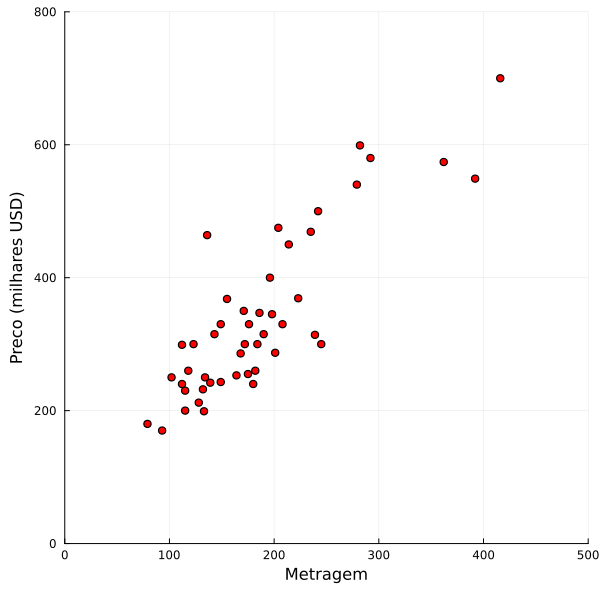
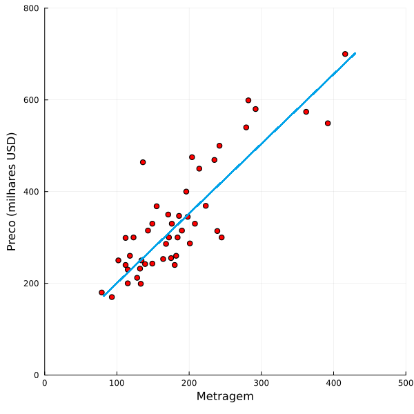
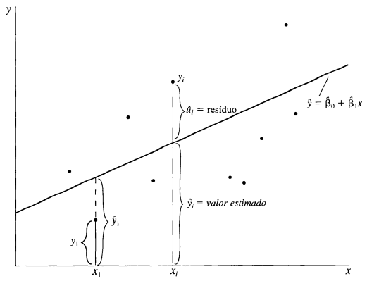

# Regressão Linear

> Notas sobre notação. Por enquanto utilizo a mesma notação que Andrew Ng no curso CS229 de Stanford a não ser que explicitado o contrário.

PRECISO REFORMULAR E DIZER QUE AS EQUAÇÕES NORMAIS SÃO UM CASO ESPECÍFICO DO MQO QUE EU JÁ DEMONSTREI, VER WIKIPEDIA [OLS](https://en.wikipedia.org/wiki/Ordinary_least_squares)

Digamos que tenhamos um conjunto de dados com duas informações: o preço de venda de casas em uma certa região, e a metragem do local (para fins desse exemplo digamos que os valores estão em metros quadrados). Podemos expor esse conjunto graficamente através do seguinte gráfico.


*Gráfico 1: Preço de Imóvel Vs. Metragem. Dados por julia4ta no GitHub.*

Essas informações nos dizem o preço de todas as casas já vendidas na região, e, para fins de simplificação, vamos supor que somente a metragem influência no preço de uma casa. Vamos então ignorar qualquer outro fator que pudesse afetar no valor de venda da propriedade coisas como: quantidade de banheiros, quartos, vizinhança, etc. Por enquanto, vamos focar somente na metragem e preço.

Agora, vamos supor que João quer vender a sua casa de 350m² e gostaria de saber a sua opinião sobre qual o valor ele deveria cobrar. Ele sabe que se colocar uma valor muito alto a casa não será vendida e se colocar um valor baixo estará perdendo dinheiro. Ou seja, com base no que você sabe sobre o preço de venda de casas na região, que valor diria para João que é o ideal? Ou ainda, se fosse outra pessoa, Maria, que lhe fizesse essa mesma pergunta só que a casa dela tem 100m², que valor diria para ela? De forma genérica podemos então formular a seguinte pergunta: 

> Dada uma casa de metragem $A$ qual será seu valor estimado de venda $p$?

Em um mundo ideal, temos uma conhecimento perfeito de como cada cada metragem influência na venda de uma casa, mas, se vivêssemos nesse mundo perfeito, computadores seriam tão poderosos em fazer previsões que o mundo que conhecemos hoje provavelmente não existiria! O que podemos fazer, então, é dar um "chute", uma previsão, analisar as informações que temos e tentar extrapolar dela uma resposta para a nossa pergunta principal.

Uma análise rudimentar dos dados parece nos mostrar que conforme a metragem de uma casa aumenta (eixo X), seu preço também aumenta (eixo Y). Podemos ilustrar isso com uma linha imaginário sobre os dados, como na Figura 1.


*Figura 1: Tendência da relação entre preço e imóvel.*

Vamos chamar essa linha de *curva de regressão*. Podemos dizer, então, para João e Maria que a estimativa do preço ideal para que eles vendam a casa está em algum lugar na curva de regressão. Matematicamente, podemos usar a fórmula da reta num plano cartesiano para mostrar a nossa curva:

$$y = b + mx$$

Ou ajustando os símbolos para os do nosso problema:

$$p = b + m*A$$

Onde $p$ é o preço da casa, $A$ é a metragem dela e $b$ e $m$ são informações para a construção da curva de regressão. $m$ controla a inclinação da curva, valores mais baixos deixam ela menos inclinada e vice-versa; no nosso cenário de casas podemos imaginar $m$ como sendo o quão "sensível" é o preço de uma casa a metragem, caso tenhamos um $m$ muito alto, mesmo um aumento pequeno em metragem se reflete em um grande aumento de preço. Esse tipo de relação, onde um aumento em $A$ reflete, proporcionalmente, em um mesmo aumento em $p$ é chamado de **relação linear**.

Com essa equação da reta definida chegamos então ao ponto importante, como determinar essa equação se tudo que temos é um conjunto de pontos? Nas próximas sessões vamos explorar alguns possíveis métodos de responder essa pergunta. O foco das sessões será na explicação do método, porém, em quadros de destaque, será continuado o exercício proposto acima de prever preço de imóveis usando regressão linear.


> [!NOTE] Exemplo de destaque
> Exemplo de quadro de destaque.
> Importante notar que tratei o valor da nossa variável target, para não lidarmos com números tão grandes dividi o valor por 1000, para fins estatísticos isso não traz nenhuma alteração, mas é importante que isso seja lembrado. O resultado das estimativas sempre estará em milhares.

## Definição Formal

Regressão Linear é um método de aprendizado de máquina muito utilizado para resolver uma grande gama de problemas. O objetivo final dele é sempre o mesmo, independente do método: traçar uma linha sobre o nosso conjunto de dados de forma a tentar prever como que outros pontos se comportariam.

Dado um certo conjunto de dados, podemos então usar uma amostra dele para tentar calibrar uma curva de regressão que melhor explica a relação linear entre os dados. Esse conjunto de dados que é usado para a criação da reta de regressão pode ser chamado "conjunto de treino". A regressão linear é um algoritmo do tipo de **aprendizado supervisionado** (em inglês, *supervised learning*), justamente porque alimentamos uma parte do nosso conjunto de dados para ele conseguir calibrar o modelo e poder gerar a curva de regressão que melhor se encaixa aos valores que temos

> [!example] Diferença de métodos
Seja pelo método de MQO ou Método do Gradiente (em inglês, *gradient descent*) o objetivo final da regressão linear é o mesmo independente do método escolhido e por isso a escolha do método depende muito mais das limitações computacionais e do nosso conjunto de dados.

Regressão linear é, então, um algoritmo de aprendizado de máquina supervisionado que tenta melhor encaixar os dados a uma reta. Essa reta terá então o seguinte formato:

$$h_{\theta}(x) = \theta_0 + \theta_1x_1$$

Onde $h$ é a nossa curva de regressão; $\theta_0$ é o intercepto; $\theta_1$ é o coeficiente angular da reta; e $x_1$ o nosso conjunto de dados. $\theta_0$ e $\theta_1$ são muitas vezes chamados de **parâmetros** do nosso modelo. O olhar atento vai notar que essa equação é muito similar a equação da reta que vimos anteriormente nesse capítulo, só temos que mudar os $\theta$ por $m$ e $b$ e é a mesma equação! A manipulação dos valores nos parâmetros nos dá então qualquer reta que pode ser representada num espaço cartesiano. **O nosso objetivo é, então, encontrar o conjunto de $\theta$ que gera a reta que melhor se encaixa no conjunto de dados**.

O intercepto é as vezes chamado de "viés", em termos geométricos, ele nos diz onde que a reta corta o eixo y quando o valor de $x_1$ é igual a 0. Em termos de aprendizado de máquina ele nos diz qual a condição inicial do nosso modelo.

Importante ressaltar que aqui estamos lidando com o caso de que o nosso conjunto de dados tem apenas uma variável, $x_1$, caso ele tenha mais variáveis elas devem ser incluídas na equação geral do modelo da seguinte forma:

$$h_{\theta}(x) = \theta_0 + \theta_1x_1 + \theta_2x_2 + \dots + \theta_nx_n$$

Ou,

$$h_{\theta}(x) = \sum_{i=0}^{n}\theta_ix_i = \theta^Tx$$

 Onde $n$ é o número de variáveis do modelo. O olhar atento vai ver que ignorei o intercepto na soma, isso porque estou assumindo $\theta$ e $x$ e como sendo um conjunto de vetores com cada um dos valores $i$. Pode-se convencionar então que $x_0 = 1$ então nosso intercepto, $\theta_0$, consegue ser incorporado na formulação geral.

## Mínimo Quadrados Ordinários (MQO)

> Ao longo desta seção usarei a mesma notação que Wooldrige em seu livro "Introdução a Econometria".

A implementação mais comum para a regressão linear é através do método dos Mínimos Quadrados Ordinários, projetos como o [SciKit-Learn](https://scikit-learn.org/stable/modules/generated/sklearn.linear_model.LinearRegression.html) em Python ou o [GLM.jl](https://juliastats.org/GLM.jl/stable/api/#GLM.lm) em Julia utilizam o MQO como forma de resolver um problema de regressão linear.

> O método de mínimos quadrados não é limitado a mínimos quadrados ordinários, existem outras derivações da mesma ideia como o mínimos quadrados lineares que é a implementação específica do SciKit Learn, contudo mantive o texto dizendo que se usa MQO pois o próprio site da biblioteca assim afirma.

Voltemos à nossa equação geral para uma curva de regressão linear, para esse exemplo vamos usar uma regressão linear bivariada:

$$y = \beta_0 + \beta_1x + u$$

Onde $y$ é a nossa curva de regressão; os $\beta$s são os nossos parâmetros; e $u$ o erro, qualquer coisa que o nosso modelo não consiga estimar, mas que pode afetar o valor da variável dependente, $y$. Chamamos esse modelo de bivariado pois relaciona duas variáveis, $y$ e $x$.

Fazemos algumas suposições sobre a natureza estatística desse modelo para que ele possa ser verdade, a primeira é que a esperança do erro é 0, ou seja, o seu valor médio é zero. Isso porque consideramos que, dado que o intercepto $\beta_0$ esteja incluído na equação, a perturbação causada pelo erro já é corrigida por este.

$$\text{E}(u)=0$$

Além disso há outro ponto importante a se considerar: como $u$ e $x$ estão relacionadas. Podemos pensar em termos de correlação, contudo uma propriedade interessante desta é que as vezes não há uma correlação direta entre o erro e a variável independente, $x$, mas sim com uma função dela, digamos $x^2$, o que pode causar problemas na hora de realizarmos uma regressão. Para isso é melhor pensarmos em termos de **qual é o valor esperado de $u$, dado $x$**.

$$\text{E}(u|x)=E(u)=0$$

Em outras palavras queremos pensar que, dado uma distribuição qualquer de $x$, o valor médio de $u$ é o mesmo, zero. Por exemplo, que não importa se uma pessoa estudou 2, 4, ou 10 anos, supomos que a aptidão natural média para um emprego qualquer é zero na hora de tentarmos criar um modelo sobre como educação influencia renda.

Por fim, assumimos também a seguinte condição:

$$\text{Cov}(u, x)=E(ux)=0$$

Ou seja, assumimos que não há correlação entre as variáveis explicativas e o erro, ou seja, o "andar" da variável $x$, nada nos diz sobre o "andar" da variável $u$.

Com isso podemos formular o nosso problem dado os nossos dados, $x$, e a nossa variável resposta, $y$, e um erro, $u$, Como podemos construir uma reta que melhor se encaixa esses dados e permite estimar resultados futuros com base no que já sabemos. Em outras palavras, como podemos obter estimativas, $\hat{\beta}_0$ e $\hat{\beta}_1$, para os nossos parâmetros $\beta_0$ e $\beta_1$?

Para isso que utilizamos o método dos Mínimos Quadrados Ordinários, ele nos permite criar uma boa estimativa para esses valores de forma a construir uma reta regressora que melhor se encaixa nos dados. Para isso, a primeira etapa é modificar a nossa equação principal e pensar em termos do valor esperado.

$$
\begin{align}
y &= \beta_0 + \beta_1x + u \newline
y - \beta_0 - \beta_1x &= u \newline
\text{E}(y - \beta_0 - \beta_1x) &= \text{E}(u) \newline
\text{E}(y - \beta_0 - \beta_1x) &= 0
\end{align}
$$

Ou ainda, dado que $\text{E}(xu)=0$,

$$\text{E}(x(y-\beta_0-\beta_1x)) = 0$$

Dada então uma amostra de dados podemos escolher o melhor $\hat{\beta}_0$ e $\hat{\beta}_1$ para se encaixar nesses dados e resolver a equação acima. A esperança é somente a média das observações então podemos reescrever a equação acima como:

$$
n^{-1}\sum_{i=1}^n x_i(y_i-\hat{\beta}_0-\hat{\beta}_1x_i)=0
$$

Podemos tentar resolver essa equação para $\hat{\beta}_0$ ou $\hat{\beta}_1$, só que temos somente uma equação, temos que achar uma outra com os mesmo termos para fazer a substituição. Para isso vamos aplicar a mesma regra de expandir a esperança a outra equação.

$$
\begin{align}
\text{E}(y - \beta_0 - \beta_1x) &= 0 \newline
n^{-1}\sum_{i=1}^n y_i-\hat{\beta}_0-\hat{\beta}_1x_i &= 0 \newline
n^{-1}\sum_{i=1}^n y_i - n^{-1}\sum_{i=1}^n \beta_0 - n^{-1}\sum_{i=1}^n \beta_1x_i &= 0 \newline
\overline{y} - n^{-1} n \beta_0 - \beta_1 \overline{x} &= 0 \newline
\overline{y} &= \beta_0 + \beta_1 \overline{x}
\end{align}
$$

Em que $\overline{y}$ é a média amostral de $y$, e igualmente para $x$. O que nos permite escrever $\beta_0$ em termos dos outros componentes.

$$\hat{\beta}_0 = \overline{y}-\hat{\beta}_1 \overline{x}$$

Assim podemos substituir na equação de antes.

$$
n^{-1}\sum_{i=1}^n x_i(y_i-(\overline{y}-\hat{\beta_1} \overline{x})-\hat{\beta}_1x_i)=0
$$

Um ponto interessante aqui é que $n$, o tamanho da amostra, é sempre maior que zero. Logo para a identidade acima se manter só precisamos que a parte da somatória seja igual a zero, por isso podemos suprimir o $n^{-1}$, não fará diferença nos cálculos e o leitor é convidado a confirmar isso.

Suprimindo o tamanho da amostra e rearranjando a equação temos que:

$$
\sum_{i=1}^n x_i(y_i-\overline{y}) = \hat{\beta}_1 \sum_{i=1}^n x_i(x_i-\overline{x})
$$

Graças a algumas propriedades da soma podemos rearranjar a equação como:

$$
\sum_{i=1}^n(x_i-\overline{x})(y_i-\overline{y})=\hat{\beta_1}\sum_{i=1}^n(x_i-\overline{x})^2
$$

Ou seja, desde que $\sum_{i=1}^n(x_i-\overline{x})^2>0$, podemos estimar $\beta_1$ como sendo:

$$
\hat{\beta}_1 = \frac{\sum_{i=1}^n(x_i-\overline{x})(y_i-\overline{y})}{\sum_{i=1}^n(x_i-\overline{x})^2}
$$

E tendo uma estimativa para $\beta_1$, podemos usar a fórmula que usamos acima para substituir o valor de $\beta_0$ para determiná-lo, $\hat{\beta}_0 = \overline{y}-\hat{\beta}_1 \overline{x}$.

E com isso temos a nossa estimativa tanto para o intercepto quanto para o coeficiente linear da reta!

Um olhar atento sobre a nossa fórmula para a estimativa de $\hat{\beta}_1$ mostra que o numerador da equação é a covariância amostral entre os nossos parâmetros e o *target* ($y$), enquanto o denominador é a variância de $x$.

> [!NOTE] Estimando com MQO
> Usando o nosso conjunto de dados de casas e as nossas fórmulas sobre como estimar o valor dos parâmetros $\beta_0$ e $\beta_1$, no nosso caso $b$ e $m$, podemos estimar os nossos parâmetros. Para isso podemos usar a fórmula:
> $$
> m = \frac{\sum_{i=1}^n(x_i-2000)(y_i-340)}{\sum_{i=1}^n(x_i-2000)^2} = 0,134533
> $$
> E para o intercepto, $b$ usamos:
> $$
> b = 340 + 0,134533 * 2000 = 71,2898
> $$
> A nossa fórmula final para estimar o preço de uma casa fica então:
> $$
> p = 71,2898 + 0.134533 * A
> $$

Agora, embora tenhamos derivado uma fórmula para os nossos parâmetros como podemos saber que ela é a ideal? Para isso vamos dar um passo para trás e pensar numa métrica para avaliar isso. O Gráfico 1 abaixo mostra um conjunto de pontos e uma possível reta para eles, vamos chamar de resíduo, $\hat{u}_i$ a diferença entre o valor real $y_i$ e o valor estimado $\hat{y}_i$.


*Interpretação dos resíduos, imagem de Wooldrige.*

Logo, se pegássemos todos os resíduos de uma regressão e somássemos, sabemos que temos a melhor reta quando esta soma tiver o menor valor possível, matematicamente queremos:

$$\sum_{i=1}^n \hat{u}_i^2 = \sum_{i=1}^n (y_i-\hat{\beta}_0-\hat{\beta}_1x_i)^2$$

O motivo de usarmos o quadrado do erro fará mais sentido quando estudarmos o que se chama modelos lineares generalizados. A segunda parte dessa igualdade mostra somente como o nosso erro é construído através dos nosso parâmetros.

Formalizando esse problema de minimização temos que:

$$\min_{b_0,b_1}\sum_{i=1}^n (y_i-b_0-b_1x_i)^2$$

Onde $b_0$ e $b_1$ são os argumentos genéricos dessa função a ser minimizada, que, por simplicidade, iremos chamar de $Q(b_0, b_1)$. Tal função terá seu mínimo quando as derivadas parciais em relação a $b_0$ e $b_1$, quando avaliados como $\hat{\beta}_0$ e $\hat{\beta}_1$, são iguais a zero; $\frac{\partial Q({\hat{\beta_0}, \hat{\beta_1}})}{\partial b_0} = 0$ e $\frac{\partial Q({\hat{\beta_0}, \hat{\beta_1}})}{\partial b_1} = 0$. Resolvendo essas equações pela regra da cadeia temos temos:

$$
\begin{align}
\frac{\partial Q({\beta_0, \hat{\beta_1}})}{\partial b_0} &= \frac{\partial}{\partial b_0}\sum_{i=1}^n (y_i-b_0-b_1x_i)^2 \newline
&= \sum_{i=1}^n 2(y_i-b_0-b_1x_i) \times(-1) \newline
&= -2\sum_{i=1}^n (y_i-b_0-b_1x_i)
\end{align}
$$

$$
\begin{align}
\frac{\partial Q{\hat{\beta_0}, \hat{\beta_1}}}{\partial b_0} &= \frac{\partial}{\partial b_1} \sum_{i=1}^n (y_i-b_0-b_1x_i)^2 \newline
&= \sum_{i=1}^n 2(y_i-b_0-b_1x_i)\times(-1x_i) \newline
&= -2\sum_{i=1}^n x_i(y_i-b_0-b_1x_i)
\end{align}
$$

Que são exatamente as equações que vimos anteriormente ao manipularmos a esperança das nossas equações originais multiplicadas por $-2n$ e, portanto, são solucionadas pelos mesmos $\hat{\beta}_0$ e $\hat{\beta}_1$.

### Implementação em Python

Como disse anteriormente, MQO é a forma mais comum de implementar métodos de regressão linear em Python. Dessa forma, iremos apresentar duas formas de implementar o algoritmo, uma "artesanal" e outra usando o pacote SciKit-Learn que fornece uma implementação de regressão linear para Python.

Primeior veremos essa implementação do zero. Podemos construir o algoritmo da seguinte forma

```python
import numpy as np

X, y = np.genfromtxt("file.csv", delimiter=",", skip_header=True, unpack=True)

y = y/1000

X_bar = np.mean(X)
y_bar = np.mean(y)

sum_xy = 0.0
sum_x2 = 0.0

for X_i, y_i in zip(X, y)
    sum_xy += (X_i - X_bar) * (y_i - y_bar)
    sum_x2 += (X_i - X_bar)**2

beta1_hat = sum_xy / sum_x2
beta0_hat = y_bar - beta1_hat * X_bar
```

Aqueles com alguma familiaridade com Python podem facilmente identificar que esse algoritmo é relativamente pouco eficiente; poderíamos construir uma *list comprehension* e depois somar o resultado da lista, ou criar uma função que passamos para um mapa.... Todas essas alternativas funcionam, mas escolhi aquela que torna mais fácil de ver como o algoritmo em si é implementado e convido a todos a criar melhores alternativas.

A segunda implementação é usando o pacote SciKit-Learn. Podemos usar a classe `LinearRegression` para dar *fit* em um modelo de regressão linear.

```python
from sklearn.linear_model import LinearRegression
import numpy as np

X, y = genfromtxt("file.csv", delimiter=",", skip_header=True, unpack=True)

y = y/1000

reg = LinearRegression()
reg.fit(X.reshape(-1, 1), y)
```

Nesse snippet `reg` é uma classe doo tipo `LinearRegression` e por isso tem acesso a todos os atributos dela, com isso podemos puxar os atributos `reg.intercept_` e `reg.coef_` para acessar o intercepto e coeficientes da regressão, respectivamente.

### Implementação em Julia

Como disse anteriormente, MQO é a forma mais comum de implementar métodos de regressão linear em Julia. Dessa forma, iremos apresentar duas formas de implementar o algoritmo, uma "artesanal" e outra usando o pacote GLM.jl que fornece uma implementação de regressão linear para Julia.

Primeiro a nossa implementação caseira. Ela é muito mais para fins de entendermos como o algoritmo funciona e pensarmos em como implementar ele. Para isso podemos construir a seguinte função:
```julia
using CSV
using Statistics

data = CSV.File("file.csv")
X = data.feature
y = data.target

X_bar = mean(X)
y_bar = mean(y)

beta1_hat = sum((X .- X_bar) .* (y .- y_bar))/sum((X .- X_bar).^2)
beta0_hat = y_bar - beta1_hat * X_bar
```

As variáveis `beta0_hat` e `beta1_hat` são então os nossos parâmetros para o modelo.

A outra implementação é usando o pacote GLM.jl que nos fornece a função `lm` como uma forma de ajustar um modelo de regressão linear a um certo conjunto de dados.

```julia
using CSV
using GLM
using TypedTables

data = CSV.File("file.csv")
X = data.feature
y = data.target

t = Table(X=X, y=y)

mqo = lm(@formula(y ~ X), t)
```

Em algumas poucas linhas já temos o nosso modelo treinado!

Algumas anotações sobre sintaxe e tipos. Criamos a `Table` `t` pois o `lm` só aceita esse tipo como input para os dados. Além disso usamos uma macro, `@formula`, como argumento da função. Esta macro vem do pacote *StatsModels.jl*, não precisamos nor preocupar com ela, só precisamos saber que a sintaxe `y ~ X` está dizendo que "y é uma relação de X", ou, "y é a variável resposta do regressor X".

> [!NOTE] Usando sobre os dados de imóveis
> Podemos passar os nossos dados sobre os imóveis para a função `lm` para poder obter os nossos preditores, fazemos isso usando o snippet acima, após isso "printamos" para o terminal o resultado do estimador com `println(mqo)` temos
> 
> ```julia
> julia > println(mqo)
> StatsModels.TableRegressionModel{LinearModel{GLM.LmResp{Vector{Float64}}, GLM.DensePredChol{Float64, LinearAlgebra.CholeskyPivoted{Float64, Matrix{Float64}, Vector{Int64}}}}, Matrix{Float64}}
>
> y ~ 1 + X
> 
>Coefficients:
> ──────────────────────────────────────────────────────────────────────────
>                 Coef.   Std. Error     t   Pr(>|t|)  Lower 95%  Upper 95%
> ──────────────────────────────────────────────────────────────────────────
> (Intercept)  71.2898    26.1331      2.73    0.0091  18.655     123.925
> X            0.134533   0.0121571    11.07   <1e-13  0.110047   0.159018
> ──────────────────────────────────────────────────────────────────────────
> ```
> Junto dos valores dos coeficientes podemos encontrar também uma série de estatísicas como o desvio padrão (`Std. Error`), o p-valor (`Pr(>|t)`), etc. 

## Método de Gradiente

A ideia por trás do método de gradiente é assumir uma valor inicial para os parâmetros e ir atualizando esse valor até encontrarmos um que melhor se encaixa ao conjunto de dados. Mas como podemos avaliar esse "encaixe" nos dados? Para isso vamos definir algo que chamaremos de Função de Custo (as vezes chamada de "Função de Perda") que medirá o quão perto $h_{\theta}(x^{(i)})$ está do valor verdadeiro $y^{(i)}$. Definiremos a Função de Custo $J(\theta)$ como:

$$J(\theta) = \frac{1}{2}\sum_{i=1}^{m}(h_{\theta}(x^{(i)})-y^{(i)})^2$$

Embora essa equação pareça assustadora a primeira vista, ela é fácil de compreender caso a quebremos em seus componentes. Uma soma de 1 até $m$, onde $m$ é o número de observações dos dados, do quadrado da diferença entre o valor estimado ($h_{\theta}(x^{(i)})$) e o valor real ($y^{(i)}$). A diferença então nos faz o trabalho de calcular o quão diferente é o nosso valor estimado do real.  

> Aqui vale a ressalva antes de prosseguirmos sobre notação, o sobrescrito $(i$) denota a $i$-ésima observação no conjunto de dados, por exemplo $x^{(2)}$ é a segunda observação.

A questão que pode surgir é onde que os outros elementos dessa conta entram. Por que dividimos o resultado da soma por dois? Por que elevamos ao quadrado? A resposta para a primeira pergunta é, por enquanto, pouco satisfatória, mais a frente, quando tivermos que manipular essa equação, a matemática se torna mais fácil quando dividimos o resultado por dois, tal operação não afeta o resultado final, só torna os cálculos mais fáceis. Já a segunda pergunta é mais interessante. Mais a frente quando estudarmos modelos lineares de forma mais ampla veremos que regressão linear é um caso específico de toda uma família de modelos chamada Modelos Lineares Generalizados (do inglês General Linear Models, GLM) e nesse momento a existência da exponenciação ficará mais clara.

Tendo em mãos uma função que podemos usar para avaliar o resultado das nossas previsões enquanto treinamos o modelo, queremos então escolher um conjunto de $\theta$ de forma a minimizar $J(\theta)$. **O processo de como fazemos essa escolha, é o elemento central dessa seção**. Vamos supor que temos valores iniciais para o conjunto de $\theta$s (normalmente esses valores são todos 0), e para fins de simplificação vamos supor que temos apenas uma variável e o intercepto, logo $\theta_1$ e $\theta_0$, o nosso algoritmo do método de gradiente vai iterar sobre os nossos valores de $\theta$, atualizando seu valor a cada nova iteração. Para cada $\theta_j$ no nosso problema ($\theta_0$ e $\theta_1$) com um valor inicial qualquer, a cada iteração ele é atualizado dada a seguinte fórmula:

$$\theta_j := \theta_j - \alpha \frac{\partial}{\partial \theta_j}J(\theta)$$

Expandindo a derivada parcial temos que,

$$\theta_j := \theta_j - \alpha \left( \sum_{i=1}^m(h_{\theta}(x^{(i)})-y^{(i)})x_j^{(i)} \right) \space \text{, para cada j}$$

> [!NOTE] Notação
> Eu uso o símbolo $:=$ em vez de somente um símbolo igual porque estamos atribuindo um valor a $\theta_j$ e não afirmando que ele é igual a algo. É o mesmo conceito de atribuição em ciência da computação como por exemplo $a := a + 1$ .

Onde $\alpha$, a chamado "taxa de aprendizagem", é um hiperparâmetro que define o quão rápido ou devagar o nosso algoritmo vai convergir para uma resposta, na prática colocamos ele como sendo igual a 0,01 e vemos se encontramos uma curva que melhor se encaixa nos dados, se não continuamos tentando; uma dica é usar intervalos de 0,01 então testar 0,02, 0,03, etc. No lado esquerdo da equação temos a derivada parcial com respeito a $\theta_j$ da função de custo, caso tenham interesse, a expansão dela está logo abaixo.

Atribuição de $\theta_j$ definida acima nos dá então um algoritmo que podemos seguir. Para cada $\theta$, ou parâmetro, do nosso modelo repetimos aquela atribuição de valor até a série convergir para algum valor. Importante ressaltar que o ajuste é feito para todos os parâmetros ao mesmo tempo para depois se checar a convergência. Por exemplo, com dois parâmetros $\theta_0$ e $\theta_1$ se realiza a atualização de valor de ambos e se verifica se o conjunto dos dois convergiram para algum valor de tal forma que a cada nova iteração não há mudanças relevantes no valor do parâmetro.

Esse último ponto é importante "cada nova iteração não há mudanças relevantes no valor do parâmetro", sabemos que conforme a série convergir aos valores ótimos de $\theta_j$ as mudanças a cada iteração serão cada vez menores justamente pela formulação do fator de erro, $(h_{\theta}(x^{(i)})-y^{(i)})$, conforme nosso algoritmo fornece um valor próximo do real, esse valor diminuí assim como o nosso "fator de ajuste" (tudo aquilo que é multiplicado pelo $\alpha$). De forma oposto, erros maiores fazem com que os ajustes a cada iteração sejam maiores.

> [!abstract]- Sobre a derivada parcial
> $$
> \begin{align}
> \frac{\partial}{\partial \theta_j} J(\theta)
> &= \frac{\partial}{\partial \theta_j}\frac{1}{2}\sum_{i=1}^{m}(h_{\theta}(x^{(i)})-y^{(i)})^2 \newline
> &= 2 \cdot \frac{1}{2} \sum_{i=1}^{m}(h_{\theta}(x^{(i)})-y^{(i)}) \cdot \frac{\partial}{\partial \theta_j} \sum_{i=1}^{m}(h_{\theta}(x^{(i)})-y^{(i)}) \newline
> &= \sum_{i=1}^{m}(h_{\theta}(x^{(i)})-y^{(i)}) \cdot \frac{\partial}{\partial \theta_j}  \sum_{i=1}^{m} \left(\sum_{k=0}^n \theta_k x_k^{(i)}-y^{(i)} \right) \newline
> &= \sum_{i=1}^{m}(h_{\theta}(x^{(i)})-y^{(i)}) \cdot \sum_{i=1}^{m} \left(\frac{\partial}{\partial \theta_j} \sum_{k=0}^n \theta_k x_k^{(i)}-y^{(i)} \right) \newline
> &= \sum_{i=1}^{m}(h_{\theta}(x^{(i)})-y^{(i)})\sum_{i=1}^{m}x_j^{(i)} \newline
> &= \sum_{i=1}^{m}(h_{\theta}(x^{(i)})-y^{(i)})x_j^{(i)}
> \end{align}
> $$
> Embora a formulação acima pareça razoavelmente complicada, ela é relativamente simples para aqueles com alguma familiaridade com derivadas parciais, apenas dois pontos merecem atenção. O primeiro é na linha quatro, onde colocamos a soma sobre todas as observações (aquela com limite superior $m$) "fora" da derivada. Isso se dá por causa de uma regra que diz que a derivada de somas é a soma de derivadas. Além disso, na última linha simplificamos o produto das somas para ser a soma dos produtos.
> Outros dois detalhes que merecem atenção é na linha três onde substituo $h_{\theta}$ por sua definição usando uma soma como vimos anteriormente; e na linha cinco onde a derivada parcial de $J(\theta)$ é simplificada a $x_j$, isso é facilmente verificável pois o único termo que depende do $\theta$ em questão é $x_j$.

Esse algoritmo descrito acima é o nosso próprio [método de gradiente](../../matematica/otimizadores/metodo_gradiente.md)! Essa versão em específica é o método do gradiente em lote, ou descida do gradiente em lote (do inglês, *batch gradient descent*). Existem outros algoritmos que funcionam na mesmo lógica de descida pelo gradiente como o descida de gradiente estocástico (do inglês, *stochastic gradient descent*) enquanto o aplicado acima precisa percorrer todo o conjunto de dados de teste para dar "um passo", ou seja, ajustar os parâmetros, o método estocástico faz a correção do valor a cada novo valor do conjunto de treino. Por percorrer todo o conjunto de dados de treino, a forma em lote costuma demandar mais poder computacional, mas, na forma apresentada aqui, costuma encontrar o máximo global sem cair em um local e ficar preso ali; por outro lado o estocástico demanda muito menos poder computacional para achar um bom valor de $\theta$, mas nunca costuma encontrar o ponto ótimo e fica oscilando em volta do mínimo global.
De forma geral, o método estocástico acaba sendo preferido por convergir mais rapidamente e fornecer resultados bons o suficientes para a maiorias dos casos.

> [!NOTE] Por que diminuir?
> Subtraímos do nosso valor de $\theta$ o $\alpha$ em vez adicionar porque nesse caso estaríamos indo para o lado oposto de um mínimo global, um máximo global. 

Como comentei antes os algoritmos de descida de gradiente tem o problema de serem suscetíveis a mínimos locais, contudo, no caso da regressão linear isso não é um problema pois não é mínimos locais para a nossa função de custo $J(\theta)$. Sabemos disso pois a função é estritamente côncava dada o seu próprio formato, $(h_{\theta}(x^{(i)})-y^{(i)})^2$, e por isso cada passo do algoritmo sempre tende para o mínimo global.

### Python

Em construção.

### Julia

Comentamos dois tipos de descidas de gradiente no código acima. Embora focamos nosso estudo na descida de gradiente por lote também comentamos a estocástica, vamos comentar a aplicação das duas nos snippets abaixo.

Primeiro a descida de gradiente em lote (BGD, *batch gradient descent*). Até onde pude verificar não há um pacote conhecido que implemente ela diretamente então vamos nos ater a implementação "artesanal". Podemos estabelecer uma função `GDBatch` como

```julia
function GDBatch(
    X::AbstractArray,
    y::AbstractArray,
    alpha::AbstractFloat = 0.001
)
    m = length(X)

    theta_0 = 0.0
    theta_1 = 0.0

    model(x) = theta_0 .+ theta_1 * x
    y_hat = model(X)
    dp_theta_0(y1) = (1/m) * sum(y_hat - y1)
    dp_theta_1(X1, y1) = (1/m) * sum((y_hat - y1) .* X1
    
    epoch = 0
    while epoch <= 200
        theta_0_ajuste = dp_theta_0(y)
        theta_1_ajuste = dp_theta_1(X, y)

        theta_0 -= alpha * theta_0_ajuste
        theta_1 -= alpha * theta_1_ajuste
        y_hat = model(X)

        epoch += 1
    end
    
    println(theta_0)
    println(theta_1)
end
```

A função acima é uma possível versão da descida de gradiente para duas variáveis, não é uma implementação particularmente eficiente e consegue suportar somente duas variáveis, mas ela serve apenas de demonstração de como o algoritmo seria quando implementado computacionalmente.

Já para a descida estocástica podemos ter a seguinte função:

```julia
# Ainda em construção
```

## Equações normais

Quando analisamos o MQO antes nesse capítulo focamos somente no caso de que há somente uma variável no modelo. Isso, muitas vezes, não é o caso na realidade. E embora o MQO como foi apresentado consegue trabalhar com diversas variáveis, apresento aqui uma alternativa a ele, as chamadas **equações normais**, que, em essência realizam o mesmo problema de minimizar os erros só que construído de uma outra maneira.

AINDA TENHO QUE MELHORAR EM COMO ELAS SÃO IGUAIS AO MQO DE ANTES

Dado um conjunto de treino com $m$ observações e $n$ parâmetros podemos construir uma matriz $X_{m \times n}$ (tecnicamente ela é $m \times n + 1$ se contarmos o intercepto, $\theta_0$ que daí nesse caso a coluna adicional seria a primeira e seria somente do valor 1, mas para fins de demonstração vou supor que ele é zero pois isso não altera a demonstração).

$$
X =
\left[
\begin{array}{c}
    \textemdash \space (x^{(1)})^T \space \textemdash \\
    \textemdash \space (x^{(2)})^T \space \textemdash \\
    \vdots \\
    \textemdash \space (x^{(m)})^T \space \textemdash \\
\end{array}
\right]
$$

De forma similar podemos definir um vetor coluna com tamanho $n$ (o número de parâmetros) que contém todos os nossos $\theta$.

$$
\theta =
\left[
\begin{array}{c}
    \theta_1 \\
    \theta_2 \\
    \vdots \\
    \theta_n \\
\end{array}
\right]
$$

Logo, podemos multiplicar um pelo outro, só que $(x^{(i)})^T\theta$ é a própria previsão do nosso modelo, $h_{\theta}(x^(i))$, então temos que:

$$
X\theta =
\left[
\begin{array}{c}
    \textemdash \space (x^{(1)})^T \space \textemdash \\
    \textemdash \space (x^{(2)})^T \space \textemdash \\
    \vdots \\
    \textemdash \space (x^{(m)})^T \space \textemdash \\
\end{array}
\right]
\cdot
\left[
\begin{array}{c}
    \theta_1 \\
    \theta_2 \\
    \vdots \\
    \theta_n \\
\end{array}
\right]
=
\left[
\begin{array}{c}
    (x^{(1)})^T\theta \\
    (x^{(2)})^T\theta \\
    \vdots \\
    (x^{(m)})^T\theta \\
\end{array}
\right] \newline \newline
=
\left[
\begin{array}{c}
    h_{\theta}(x^{(1)}) \\
    h_{\theta}(x^{(2)}) \\
    \vdots \\
    h_{\theta}(x^{(n)}) \\
\end{array}
\right]
$$

Seguindo essa mesma linha de representar nossos elementos da equação como vetores, definimos $\vec{y}_m$ como sendo o vetor coluna de tamanho $m$ com os *target*s, isso é, o valor real, para o nosso dataset de treino.

$$
\vec{y} = 
\left[
    \begin{array}{c}
        y^{(1)} \\
        y^{(2)} \\
        \vdots \\
        y^{(m)} \\
    \end{array}
\right]
$$

E se subtrairmos $X\theta$ de $\vec{y}$ temos:

$$
\begin{align}
X\theta - \vec{y} &=
\left[
\begin{array}{c}
    (x^{(1)})^T\theta \\
    (x^{(2)})^T\theta \\
    \vdots \\
    (x^{(m)})^T\theta \\
\end{array}
\right]
-
\left[
    \begin{array}{c}
        y^{(1)} \\
        y^{(2)} \\
        \vdots \\
        y^{(m)} \\
    \end{array}
\right] \newline\newline
&=
\left[
\begin{array}{c}
    (x^{(1)})^T\theta - y^{1} \\
    (x^{(2)})^T\theta - y^{2} \\
    \vdots \\
    (x^{(m)})^T\theta - y^{m} \\
\end{array}
\right]
\end{align}
$$

O que é muito similar da nossa equação da função de custo $J(\theta) = \frac{1}{2}\sum_{i=1}^{m}(h_{\theta}(x^{(i)})-y^{(i)})^2$

Logo, usando a propriedade de que para um vetor $\vec{v}$ qualquer de tamanho $n$, temos que $\vec{v}^T\vec{v} = \sum^n_{i=1} \vec{v}_i^2$ (propriedade esta, também chamada de norma euclidiana). Podemos expressar a função de custo $J(\theta)$ em forma de matrizes.

$$\frac{1}{2}(X\theta - \vec{y})^T(X\theta-\vec{y}) = \frac{1}{2}\sum_{i=1}^{m}(h_{\theta}(x^{(i)})-y^{(i)})^2$$

Dessa forma podemos minimizar a função de custo $J(\theta)$ derivando-a e igualando-a a zero. Para isso primeiro devemos achar a [derivada](../../matematica/alg_linear/matrizes##Notação $\nabla$ (nabla) para derivadas) em relação a $\theta$ da função.

$$
\begin{align}
\nabla_{\theta}J(\theta) &= \nabla_{\theta} \frac{1}{2}(X\theta - \vec{y})^T (X\theta - \vec{y}) \newline
&= \frac{1}{2}\nabla_{\theta}(X^T\theta^T X\theta - X^T\theta^T \vec{y} - \vec{y}^T X\theta + \vec{y}^T\vec{y}) \newline
&= \frac{1}{2}\nabla_{\theta} \text{tr}(X^T\theta^T X\theta - X^T\theta^T \vec{y} - \vec{y}^T X\theta + \vec{y}^T\vec{y}) \newline
&= \frac{1}{2}\nabla_{\theta} (\text{tr}(X^T\theta^T X\theta) - 2 \cdot\text{tr}(\vec{y}^TX\theta) - \text{tr}(\vec{y}^T\vec{y})) \newline
&= \frac{1}{2} (X^TX\theta + X^TX\theta - 2\vec{y}X^T) \newline
&= X^TX\theta-X^T\vec{y}
\end{align}
$$

Algumas explicações são necessárias para essa derivação. Na terceira etapa usamos o fato de que o traço de um escalar é o próprio escalar; na quarta etapa usei o fato de que $\text{tr}(A^T) = \text{tr}(A)$ então pude agregar aqueles dois termos; na sexta etapa me utilizo das propriedades da derivada de matrizes e do traço ( $\nabla_A \text{tr}(ABA^TC)=B^TA^TC^T+BA^TC$ sendo $A^T=\theta$, $B=B^T=X^TX$, e $C=I_{n \times n}$, sendo $I$ a matriz identidade); por fim na mesma quinta etapa desconsidero o termo $\vec{y}^T\vec{y}$ pois para a derivada em relação a $\theta$ ele é constante.

Temos então que a derivada de $J(\theta)$ com respeito a $\theta$ é $\nabla_{\theta}J(\theta) = X^TX\theta-X^T\vec{y}$

Para minimizarmos, achar o mínimo local, definimos ela como sendo igual a zero, logo

$$
\begin{align}
0 &= X^TX\theta-X^T\vec{y} \newline
X^TX\theta &= X^T\vec{y}
\end{align}
$$

Reorganizando a equação temos então que:

$$\theta = (X^TX)^{-1}X^T\vec{y}$$

E com isso temos uma equação que nos dá os coeficientes ótimos com base no nosso conjunto de dados de treino!

### Implementação em Python

Bibliotecas como o SciKit-Learn usam já versões das equações normais para resolver seus problemas de regressão linear, dessa forma a versão incluída aqui é uma construída do zero usando somente o numpy.

```python
import numpy as np
from numpy.linearalg import inv

X, y = np.genfromtxt("file.csv", delimiter=",", skip_header=True, unpack=True)

y = y / 1000

one = np.one((len(X), 1))
X = np.hstack((one, X.reshape(-1, 1)))

theta = inv((X.T @ X)) @ (X.T @ y)
```

O código acima assume a existência de somente uma feature e o target, no caso de mais features temos que fazer leves modificações. Podemos organizar todos os dados em um formato de DataFrame, separar os features dos targets e em seguida converter esses objetos para o formato de matriz do NumPy.

### Implementação em Julia

Embora pacotes como glm.jl utilizem uma versão das equações normais para resolver problemas de regressão linear. Vamos aqui implementar o algoritmo do zero.

```julia
using CSV

# Renomeio a função para facilitar o uso
T = transpose

data = CSV.File("file.csv")

m = length(data)
X = [ones(m) data.feature]
y = data.target

theta = inv(T(X)*X)*T(X)*y
```

No snippet acima, assumimos a existência de uma só feature, `feature`. Para o caso de termos mais de uma o código tem leves modificações. Podemos passar `data` para um DataFrame e depois remover a coluna target e depois converter esse DF para uma matriz para fazer as operações, há diversas formas de se fazer isso.

Outro detalhe é que usamos a função `ones` para criar um *array* bidimensional de duas colunas, a primeira sendo somente de 1. Fazemos isso para o algoritmo levar em conta o intercepto, caso não a coloquemos o $\theta_0$ não seria calculado.

> [!NOTE] Usando dados de imóveis
> Podemos usar nosso o snippet acima para rodar o código com o nosso conjunto de dados. Isso nos retorna um vetor na seguinte forma `[71.28977422922198, 0.13453271876836156]`, o primeiro valor é o nosso intercepto, o seguinte o nosso $m$.

---

## Referências

**Stanford Online**. Stanford CS229: Machine Learning - Linear Regression and Gradient Descent | Lecture 2 (Autumn 2018). https://www.youtube.com/watch?v=4b4MUYve_U8.

**doggo dot jl**. \[05x02\] Linear Regression | Regression | Supervised Learning | Machine Learning \[Julia\].  https://www.youtube.com/watch?v=n03pSsA7NtQ.

**julia4ta**. tutorials. https://github.com/julia4ta/tutorials/tree/master.

**maxim5**. cs229-2018-autumn. https://github.com/maxim5/cs229-2018-autumn.

**Jeffrey M. Wooldrige**. Introdução à Econometria: Uma abordagem moderna. 4ª edição.

**Aurélien Géron**. Mãos à Obra: Aprendizado de Máquina com Sciki-Learn, Keras & TensorFlow. 2ª edição.
