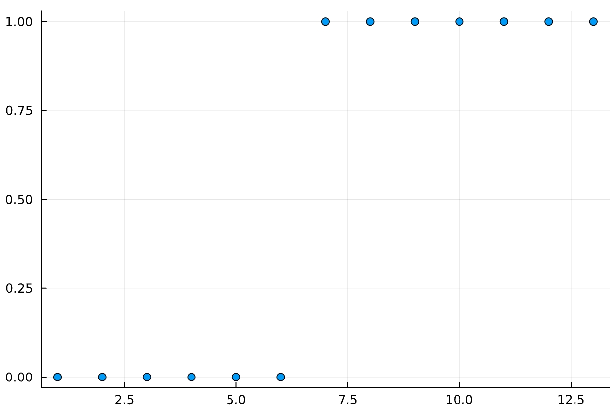
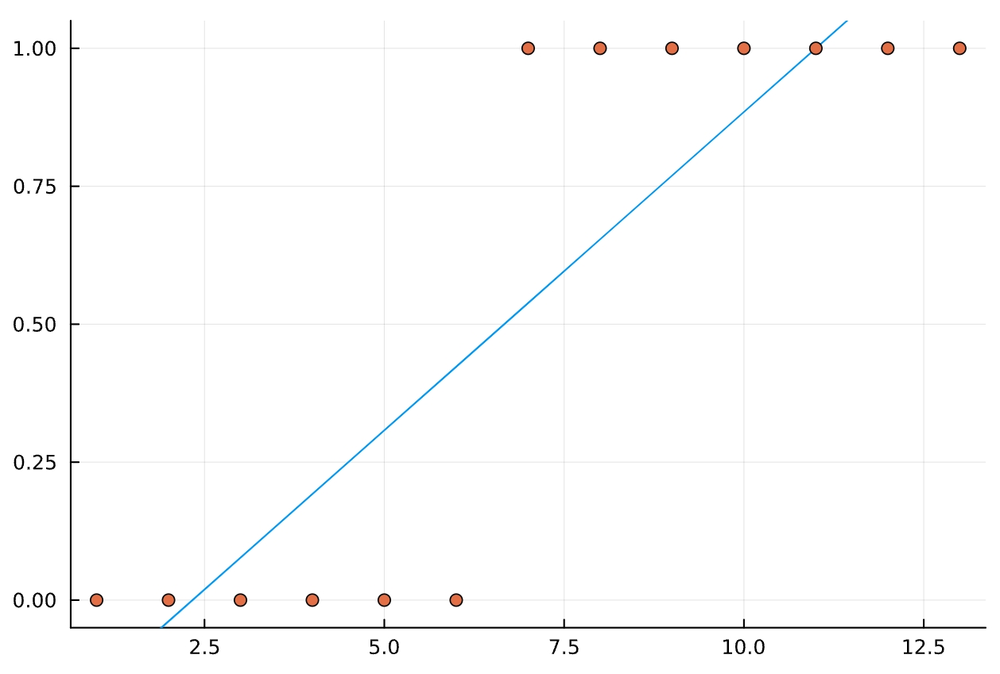
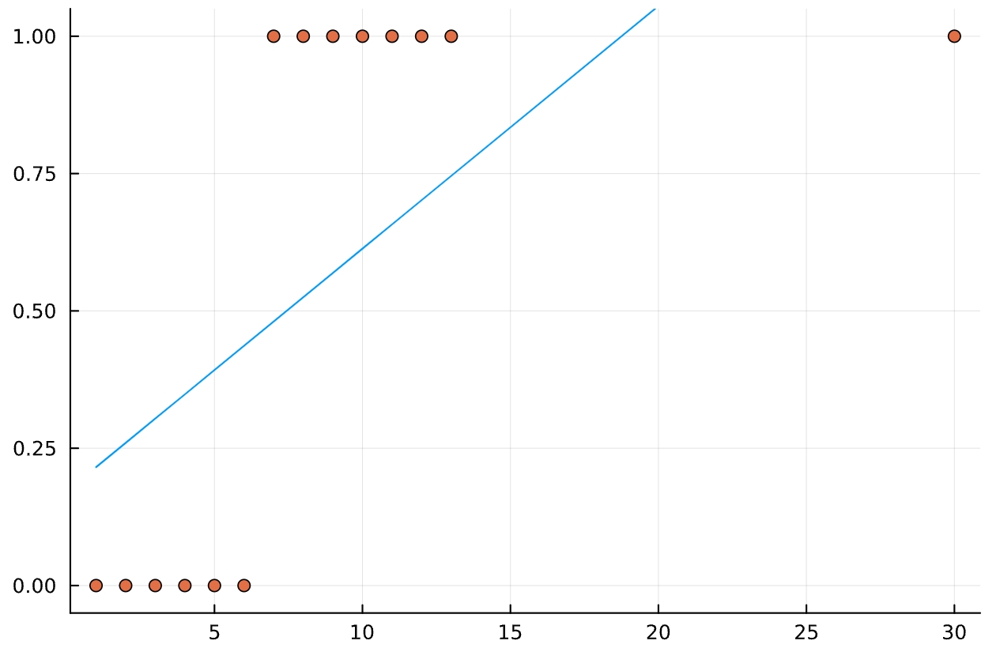
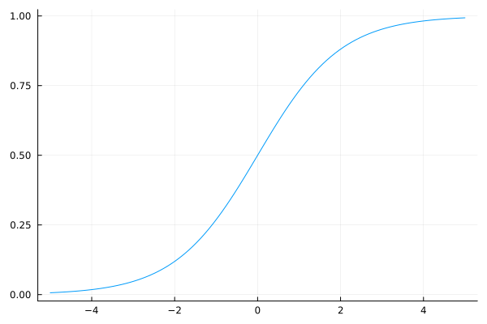
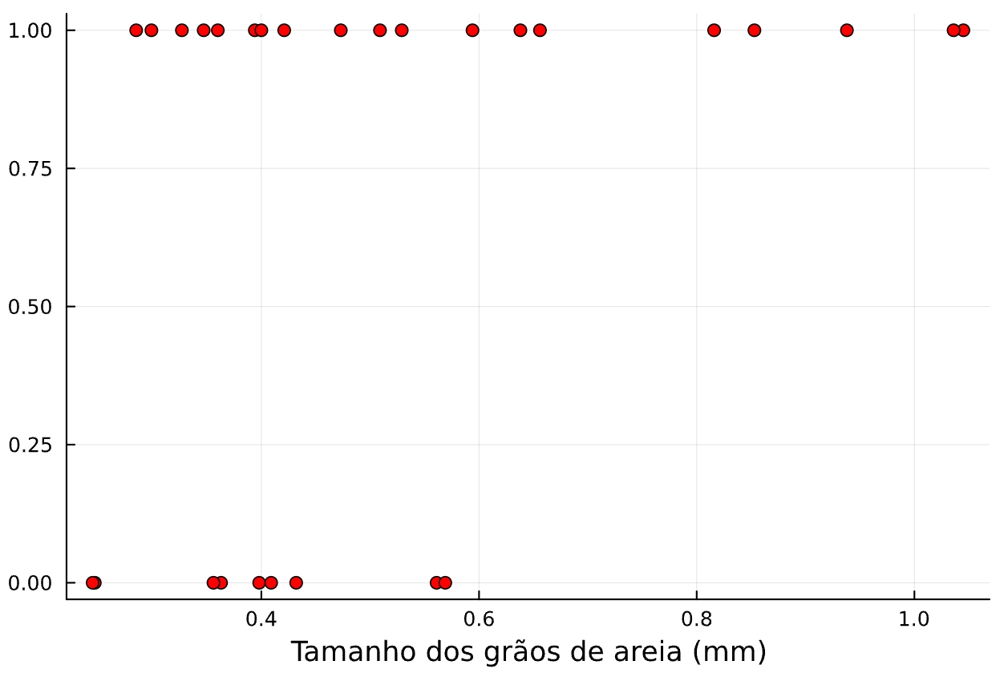
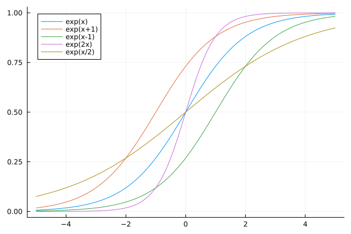
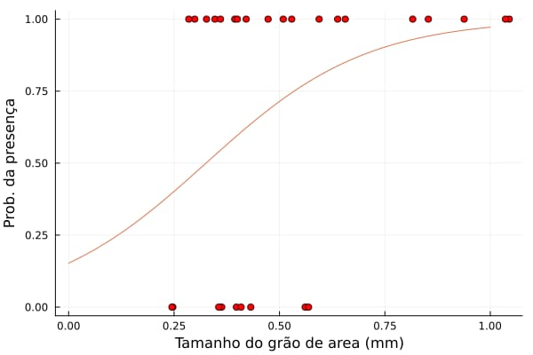
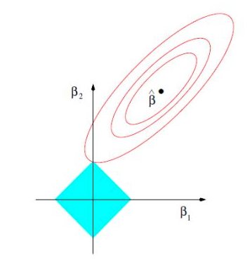
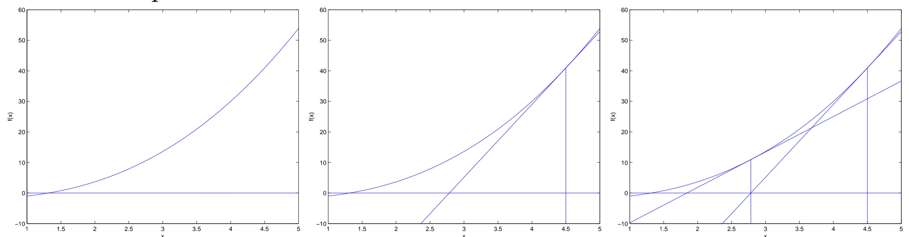

# Regressão Logística

Você trabalha em laboratório e foi encarregado de criar um modelo que ajude pesquisadores a descobrir se, dado o tamanho de nódulo na pele, aquilo pode ser, ou não um câncer. Queremos então estimar a probabilidade do nódulo ser um câncer, de 0% a 100%. Uma primeira tentativa pode ser de tentar usar um método de regressão, como a regressão linear, ao conjunto de dados, gerar uma curva de regressão e avaliar o resultado, se for maior que 0.5, ou qualquer outro valor limite, definir como verdadeiro, caso contrário falso.

Vamos tentar ilustrar isso com um exemplo. Digamos que tenhamos o seguinte conjunto de dados sobre o tamanho de nódulos, no eixo X temos o tamanho deles e no eixo Y definimos um valor binário como o nosso *target*, se o nódulo é maligno ou não, 0 ou 1.


*Figura 1: Conjunto de dados de exemplo.*

Obviamente esse conjunto de dados é extremamente simplista e serve apenas para fins de demonstração, mais tarde mostrarei um conjunto mais adequado para exemplos futuros.

Rodando uma regressão temos uma curva com o seguinte formato.


*Figura 2: Regressão linear sobre o nosso conjunto de exemplo.*

Uma possível forma de definir se o valor estimado é 0 ou 1, é: se o valor da regressão for maior que 0,5 classificamos o ponto como 1, maligno, caso contrário 0, benigno. Embora tal solução pareça eficiente ela não se sustenta caso estressemos o modelo adicionando mais pontos ao conjunto de dados.

No novo conjunto, o ponto mais a esquerda é representa o caso de um nódulo maligno (1), só que, como seu tamanho é desproporcionalmente maior que os outros, a regressão acaba por capturar a influência deste e perdemos muito da precisão no nosso modelo. Vários valores que deveriam ser classificados como 1 em um conjunto de dados "comportados" aqui são erroneamente classificados como 0.


*Figura 3: Regressão linear sobre o conjunto com um outlier.*

Tal problema se torna ainda maior conforme a fronteira de decisão, isso é, quando algo é 0 ou 1, se torna ainda mais enevoada. Precisamos de um novo tipo de algoritmo para lidar com isso, problemas como esse, em que estamos tentando estimar um valor discreto (0 ou 1) chamamos de **problemas de classificação e, consequentemente, precisamos de algoritmos de classificação**.

Um dos algoritmos mais comuns para problemas de classificação é a regressão logística, ela é baseada na curva logística inicialmente criada no século 19 pelo matemático belga Pierre François Verhulst como um modelo de crescimento populacional. Não é claro porque ele a chamou de "logística". Anos depois, já no século 20 se observou que ela pode ser usada como uma fronteira de decisão quando queremos estimar a probabilidade de uma classe (por isso chamamos de regressão inclusive, mesmo sendo usado em problema de classificação) e como modelo se tornou amplamente utilizada em uma série de problemas.


*Figura 4: Curva logística padrão.*

Ao longo deste capítulo usarei como dados de exemplo uma pesquisa que catalogou a presença de uma espécie em extinção de aranha lobo em praia pela costa do Japão, assim como o tamanho dos grão de areia na praia em questão. O gráfico abaixo nos mostra esses dados, sendo o eixo y a presença ou não da aranha (1 ou 0) e o no eixo x o tamanho dos grãos de areia.


*Figura 5: Tamanho dos grãos de areia das praia em que foi encontrada uma aranha lobo.*

## Definição formal

Podemos definir a regressão logística como um algoritmo usado para classificação, ele pode ser usado tanto em problemas onde há múltiplas classes; por exemplo, dada a foto de uma fruta identificar se é uma maçã, banana, pera, etc; quanto binárias, 0 ou 1. Por enquanto vamos focar em problemas de classificação binária. Dizemos que o valor 1 é a presença daquilo que estamos estimando e 0 a não presença, um tumor ser maligno ou não; um email, ser spam ou não; etc.

Chamamos cada um dos possíveis resultados de classe (a classe em que o email é um spam, e a classe em que ele não é...), e tanto para problemas multinomiais (múltiplas classes) quanto binários (duas classes, presença ou não) queremos estimar a probabilidade de pertencimento à classe. Dessa forma queremos uma função que nos retorne valores entre 0 e 1, que podemos interpretar como a probabilidade. Aqui entra a função logística. Sua imagem é definida dentro do intervalo fechado $\{0,1\}$, a equação para sua construção é a que segue.

$$
y = \frac{1}{1+e^{-x}}
$$

Contudo, essa equação é "fechada", não aceita parâmetros se não o próprio $x$, logo como podemos alterar ela para se encaixar no nosso modelo?

O elemento da equação que controla a "forma" da equação, isso é, o quão para esquerda ou direita a curva está deslocada, ou o quão inclinada é a curva é o elemento $e^{-x}$, mais especificamente o seu expoente $-x$, logo alterando ele podemos criar outras curvas.


*Figura 6: Como parâmetros alteram o formato da curva.*

Ao mexer nos parâmetros podemos mover nossa curva. Deixá-la mais reta para valores mais altos de X, ou talvez achatá-la fazendo com que ela só assuma valores maiores que 0,5 só com valores muito grandes de X. Tudo isso, ou o oposto. Existem infinitas formas de que podemos modificar essa curva e para cada modificação existe um conjunto de dados que melhor se encaixa a ela. No nosso exemplo anterior sobre a aranhas lobo, mais para frente construiremos a curva de regressão, mas desde já eu posso dizer que, para valores de X acima de 0,6 seu resultado será maior que 0,5, pois todos os casos registrados no conjunto de dados de praias com areia maior que 0,6mm havia a presença da aranha.

Em resumo, queremos encontrar o melhor conjunto de $\theta$ para um certo conjunto de dados.

Definimos então um conjunto de parâmetros $\theta$ e dados $x$, ambos representados como vetores, que serão o nosso novo expoente na função logística. Como $\theta^Tx$ é um escalar, a função segue retornando valores dentro do intervalo $\{0, 1\}$.

$$
h_{\theta}(x) = \frac{1}{1+e^{-\theta^Tx}}
$$

Em outros problemas como regressão linear há um fórmula que nos dá o valor ideal, porém, com regressão logística não há nenhum algoritmo que nos dá os valores ideias dos parâmetros $\theta$. Existem casos especiais onde se sabe como achar uma solução analítica para o problema de otimização, mas, de forma geral, ainda não se descobriu um formato ideal de curva dado um conjunto de pontos.

Nos resta então a pergunta, como achar um conjunto de $\theta$s dado que não temos uma solução analítica definida para o problema? Nesse caso temos que usar algoritmos de otimização, assim como pode ser feito com [regressão linear e descida de gradiente](regressao_linear.md#metodo-de-gradiente) (na verdade podemos usar o mesmo [método de gradiente](../../matematica/otimizadores/metodo_gradiente.md) e vamos explorar seu uso mais a frente). Contudo, antes de pularmos para os métodos vamos ver como podemos ter certeza de que há uma função que podemos otimizar e que podemos usar como função de custo para um algoritmo como descida de gradiente.

Vamos definir a função de probabilidade para cada uma das ocorrências da variável resposta $y$,

$$
\displaylines{
p(y=1|x;\theta)=h_{\theta}(x)\\
p(y=0|x;\theta)=1-h_{\theta}(x)
}
$$

A segunda equação é consequência da primeira, obviamente, se a probabilidade de ser da classe 1 é de 90%, a probabilidade de ser da classe 0 é de 10% (1-0,9).

Podemos reorganizar ambas equação em somente uma da seguinte forma,

$$
p(y|x;\theta)=(h_{\theta}(x))^y(1-h_{\theta}(x))^{1-y}
$$

Organizar a equação dessa forma é mais um "truque" do que qualquer outra coisa. O leitor pode verificar que em ambos os cenários, seja 0 ou 1, caso coloquemos o valor de $y$ na fórmula nos resta somente aquele que foi explicitado no par de equações anteriores.

Com isso, podemos calcular a verossimilhança de $p(\hat{y}|X;\theta)$, assumindo $m$ como um conjunto de dados em que cada ponto foi gerado de forma independente, temos que

$$
\begin{align}
\mathcal{L}(\theta)&=p(\hat(y)|X;\theta) \newline
&=\prod_{i=1}^{m}p(y^{(i)}|x^{(i)};\theta) \newline
&=\prod_{i=1}^{m}(h_{\theta}(x)^{(i)})^{y^{(i)}}(1-h_{\theta}(x^{(i)}))^{1-y^{(i)}} \newline
\ln(\mathcal{L}(\theta))&=\ln\left(\prod_{i=1}^{m}(h_{\theta}(x)^{(i)})^{y^{(i)}}(1-h_{\theta}(x^{(i)}))^{1-y^{(i)}}\right) \newline
\ell(\theta)&=\sum_{i=1}^{m}y^{(i)}\ln(h_{\theta}(x^{(i)}))+(1-y^{(i)})\ln(1-h_{\theta}(x^{(i)}))
\end{align}
$$

Derivando o logaritmo da verossimilhança (usamos o logaritmo desta para facilitar contas futuras, seu uso não impacta nos resultados) chegamos na equação abaixo,

$$
\frac{\partial \ell(\theta)}{\partial\theta} = \sum_{i=1}^{m} \left( y^{(i)} - h_{\theta}(x^{(i)}) \right)x^{(i)}
$$

Quem tem familiaridade com regressão linear vai notar que essa equação é exatamente igual a derivada da função de custo de uma regressão linear. O motivo para isso é porque ambos fazem parte de uma mesma família de algoritmos chamada de "modelos lineares generalizados", em outro capítulo falarei mais sobre esse tipo de algoritmo.

> [!NOTE] Derivação da verossimilhança
> Antes de qualquer coisa vamos definir a derivada da logística $g(z)$
> $$
> \begin{align}
> \frac{\partial g(z)}{\partial z} &= \frac{d}{dz} \frac{1}{1+e^{-z}} \newline
> &= \frac{1}{(1+e^{-z})^2}(e^{-z}) \newline
> &= \frac{1}{1+e^{-z}} \times \left( 1 - \frac{1}{1+e^{-z}} \right) \newline
> &= g(z)(1-g(z))
> \end{align}
> $$
> Essa derivação sera útil logo a frente, vamos então derivar $\ell(\theta)$ usando essa informação e notação,
> $$
> \begin{align}
> \frac{\partial \ell(\theta)}{\partial\theta} &= \frac{\partial}{\partial\theta}\sum_{i=1}^{m}y^{(i)}\ln(g(\theta^Tx^{(i)}))+(1-y^{(i)})\ln(1-g(\theta^Tx^{(i)})) \newline
> &= \sum_{i=1}^{m} \frac{\partial}{\partial\theta} \left(y^{(i)}\ln(g(\theta^Tx^{(i)}))+(1-y^{(i)})\ln(1-g(\theta^Tx^{(i)}))\right) \newline
> &= \sum_{i=1}^{m} \left( y^{(i)}\frac{1}{g(\theta^Tx^{(i)})}g(\theta^Tx^{(i)}) (1-g(\theta^Tx^{(i)}))x^{(i)} - (1-y)(\frac{1}{1-g(\theta^Tx^{(i)})})g(\theta^Tx^{(i)})(1-g(\theta^Tx^{(i)}))x^{(i)} \right) \newline
> &= \sum_{i=1}^{m} \left( y^{(i)}(1-g(\theta^Tx^{(i)}))x^{(i)} - (1-y)g(\theta^Tx^{(i)})x^{(i)} \right) \newline
> &= \sum_{i=1}^{m} \left( y^{(i)}(1-g(\theta^Tx^{(i)})) - (1-y)g(\theta^Tx^{(i)}) \right)x^{(i)} \newline
> &= \sum_{i=1}^{m} \left( y^{(i)}-g(\theta^Tx^{(i)})y^{(i)} - g(\theta^Tx^{(i)}) - g(\theta^Tx^{(i)})y^{(i)} \right)x^{(i)} \newline
> &= \sum_{i=1}^{m} \left( y^{(i)} - g(\theta^Tx^{(i)}) \right)x^{(i)} \newline
> \end{align}
> $$
> O único ponto que levanto atenção é na terceira linha onde expando as derivadas e troco o sinal que separa as duas partes da equação, de mais por menos. Isso porque ao derivarmos $(1-g(\theta^{T}x^{(i)}))$ temos $-\frac{\partial g(\theta^{T}x^{(i)})}{\theta}$.

Com a derivada temos então a nossa função de custo para poder usar em algum método como gradiente ascendente ou método de newton que nos permite achar o melhor conjunto de $\theta$ dado um grupo de observações.

O problema de otimização pode ser formalizado como

$$
\min_{\theta} \sum_{i=1}^m \left( y^{(i)} - \frac{1}{1+e^{-\theta^Tx^{(i)}}} \right) x^{(i)}
$$

Nas seções abaixo vamos explorar o uso desses algoritmos para poder resolver um problema de regressão logística.

### Implementação em Julia

Mais a frente veremos como a biblioteca SciKit-Learn nos permite o uso de diversos *solvers* para resolver um problema de regressão logística. Julia, por sua vez, embora tenha bibliotecas implementadas com todos esses métodos, a principal biblioteca para resolver problemas de modelos lineares não funciona dessa forma.

A [GLM.jl](https://juliastats.org/GLM.jl/stable/) se baseia no conceito de modelos lineares generalizados e utiliza uma função única para otimizá-los, o que importa aqui é o tipo de distribuição e "*link*" que se passa para esse método. O Iteratively Reweighted Least Squares (IRLS), usado pelo GLM.jl, consegue se adaptar a todos os modelos lineares e é o usado pela implementação para resolver problemas deste tipo. O uso dele assim como o conceito de modelo linear generalizado será explorado em outro capítulo. Por enquanto me atenho a explicar seu uso para resolver um problema de regressão logística.

```julia
using GLM

model = glm(@formula(y~x), df, Binomial(), LogitLink())
```

`@formula` é a nossa macro que define a fórmula a ser usada pelo modelo. Aqui ela relaciona como `y` como sendo dependente de `x`.

`df` é o nosso conjunto de treino, importante notar que os nomes da colunas devem ser os mesmo que passamos para `@formula`.

> [!NOTE] Estimando a presença de aranhas nas praias do Japão
> Podemos rodar a nossa a nossa regressão logística sobre o nosso conjunto de dados e obtemos o seguinte resultado
> ```julia
> julia> model = glm(@formula(Y~X), data, Binomial(), LogitLink())
> StatsModels.TableRegressionModel{GeneralizedLinearModel{GLM.GlmResp{Vector{Float64}, Binomial{Float64}, LogitLink}, GLM.DensePredChol{Float64, LinearAlgebra.CholeskyPivoted{Float64, Matrix{Float64}, Vector{Int64}}}}, Matrix{Float64}} 
> Y ~ 1 + X 
> Coefficients: 
> ───────────────────────────────────────────────────────────────────────
> .               Coef.  Std. Error     z  Pr(>|z|)  Lower 95%  Upper 95% 
>────────────────────────────────────────────────────────────────────────
> (Intercept) -1.71248      1.37512 -1.25    0.2130  -4.40776    0.982708
> X            5.25652      3.0544   1.72    0.0853  -0.729993  11.243 ────────────────────────────────────────────────────────────────────────
> ```
> Podemos então criar uma curva que tem o seguinte formato
> 

## Regularização

Um problema que assombra a pesquisa em aprendizado de máquina é o sobreajuste (do inglês, *overfitting*), quando a nossa curva de regressão se ajusta demais ao conjunto de dados e não consegue generalizar o problema o suficiente para gerar boas previsões. Uma forma de resolver esse problema é usando de fatores de **regularização**. Aplicamos a função de custo um fator a mais durante o treinamento que força a função a se ajustar aos dados da forma que queremos. Existem diversas formas de generalização e, dependendo do *solver* que escolhemos, alguns métodos de regularização podem não funcionar.

Chamaremos de $r(\theta)$ a função de regularização de $\theta$, adicionamos ela ao final da nossa função de custo assim nós temos que $J(\theta) := J(\theta) + \lambda r(\theta)$, onde $\lambda$ define o quão intensa é a regularização, implementações como do SciKit-Learn usam o inverso de $\lambda$, normalmente denotado como $C$.
 
### $\ell_1$

A regularização $\ell_1$, as vezes chamada de regularização LASSO, adiciona a função de custo a norma dos parâmetros, isso é

$$
r(\theta) = \|\vec{\theta}\|_1 = \sum_{j=0}^n |\theta_j|
$$

Sendo $\vec{\theta}$ o vetor com todos os parâmetros da função.

A regularização $\ell_1$ tem a propriedade de permitir que alguns parâmetros flutuem livremente enquanto força outros à zero, tal propriedade é muito útil por nos permitir ver quais são as *features* menos importantes do nosso modelo, muitas vezes esse processe é chamado de **seleção de *features*** (*feature selection*).

Para entender o porque isso acontece, nos é útil dar um passo atrás no formato geral e voltarmos a pensar em restrição de uma função como nos é mostrado em aulas de cálculo:

$$
\min_{\theta}J(\theta) \space s.t. \space r(\theta) \le k
$$

$k$ é uma constante arbitrária, para fins do nosso exemplo podemos ignorá-la. O gráfico abaixo mostra uma função de custo, no meio, $\hat{\beta}$, temos o ponto ótimo, o mínimo, e as elipses ao redor se chamam **curvas de nível**, em cada uma delas o custo é constante em qualquer ponto desta. Queremos então chegar o mais perto do centro dessas elipses, só que temos um fator que restringe o quão perto podemos chegar, este é o quadrado azulado, $r(\theta) \le k$. A regularização impõe uma restrição sobre os parâmetros, geometricamente, estes tem que estar em algum lugar dentro da área delimitada pela restrição.



Qual é então o ponto mais perto do ponto ótimo que podemos chegar dada a nossa restrição? Como a área definida pela regularização LASSO é "pontuda", é muito mais provável que o ponto mais perto de $\hat{\beta}$ seja uma das pontas, e justamente nesses pontos alguns dos valores dos parâmetros tendem a cair a zero.

Agora, por que escolheríamos um ponto que parece mais longe do ótimo que outros? Esse é a pergunta mais importante no que tange a regularização, para exemplos como esse, com somente duas variáveis, realmente regularização não só é inútil como traz resultados piores. Vemos a utilidade quando começamos a adicionar variáveis ao nosso processo, o uso da regularização LASO nos permite realizar a seleção de features, e não somente, ao restringir a forma como os nossos parâmetros crescem impede o modelo de se sobreajustar aos dados visto que agora eles não podem assumir qualquer valor.

### $\ell_2$

A regularização $\ell_2$, as vezes chamada de regularização Ridge ou regularização de Tikhnov, é similar a $\ell_1$ só que em vez de usarmos a norma do vetor usamos o quadrado desta.

$$
r(\theta) = \|\vec{\theta}\|_2^2 = \sum_{j=0}^n |\theta_j|^2
$$

Diferente da regularização LASSO, os parâmetros regularizados por $\ell_2$ não chegam em zero, mas costumam orbitar perto de zero. Por causa da penalidade forte causada por usarmos o quadrado da norma os valores dos coeficientes tendem a ser baixos, contudo, nenhum tende a ser igual a zero.

### Elastic-net

Regularização Elastic-Net é a combinação da regularização $\ell_1$ com $\ell_2$. Tanto a Lasso quanto Ridge, podem trazer consequências indesejadas ao nosso modelo: LASSO pode acabar por selecionar poucas features ao colocar muitas próximas de zero; Tikhnov por aproximar de zero os parâmetros pode diminuir a importância de features que deveriam ter maior importância, o que também piora o tratamento de outliers.

Elastic-Net se propõe a resolver tais problemas usando os dois tipos de regularização. Temos então uma função $r$ na seguinte forma:

$$
r(\theta) = \frac{1 - \rho}{2}\|\theta\|_2 + \rho \|\theta\|_1
$$

Onde $\rho$ é a importância que se dá a cada um dos componentes, $\ell_1$ e $\ell_2$, no SciKit-Learn, o parâmetro `l1_ratio` é o nosso $\rho$.

Embora o Elastic-Net combine ambos os modos de regularização, caso seja muito claro que um dos métodos sozinhos seja melhor (no caso seleção de *features* ou de alta correlação entre elas) é preferível usar LASSO ou Ridge sozinho.

## Gradiente Ascendente

Quando trabalhamos com [regressão linear](regressão_linear.md) usamos o algoritmo de descida do gradiente (do inglês, *gradient descent*), $\theta_j := \theta_j - \alpha\frac{\partial J(\theta)}{\partial\theta}$, mas aqui queremos usar o gradiente ascendente (do inglês, *gradient ascent*).

Ao lidarmos a função de verossimilhança $\mathcal{L}(\theta)$, ou o seu logaritmo $\ell(\theta)$, queremos maximizar a probabilidade do conjunto de parâmetros $\theta$ se "encaixar" ao conjunto de dados $X$. Dessa forma o nosso otimizador quer maximizar o resultado e não minimizar. Para o método do gradiente, isso é feito invertendo o sinal do fator de ajuste do parâmetro $\theta_j$.

$$
\theta_j := \theta_j + \alpha\frac{\partial\ell(\theta)}{\theta}
$$

$\alpha$ é a nossa taxa de aprendizado, o quão o rápido ou devagar o nosso algoritmo converge para uma resposta. Aplicando o resultado da derivada da seção anterior temos então que a regra de atualização é:

$$
\theta_j := \theta_j + \alpha \left( \sum_{i=1}^m(y^{(i)} - h_{\theta}(x^{(i)}))x_j^{(i)} \right) \space \text{, para cada j}
$$

### Implementação em Python

Acima demonstrei a descida de gradiente usando a descida de gradiente por lote, mas o normal é usarmos a descida estocástica ou alguma variação.

No [SciKit-Learn](https://scikit-learn.org/1.5/modules/generated/sklearn.linear_model.LogisticRegression.html) temos duas opções para solvers que usam o método de gradiente, o primeiro é `sag`, *Stocastic Average Descent*, uma versão da descida estocástica em que o método de atualização é o mesmo, a cada observação alteramos nossos parâmetros, mas o valor final é determinado pela média do valor de cada iteração do algoritmo. O segundo é o `saga` uma versão aprimorada do SAG que garante que não haja vieses nos valores estimados

Tanto o método `sag` quanto o `saga` são bons quando há uma grande número de observações, contudo somente o `saga` consegue suportar a regularização Elastic-Net, `sag` suporta somente $\ell_2$.

> [!NOTE] Caso multinomial
> Mais abaixo será explorado o caso multinomial, quando há mais de uma classe, já vale o comentário que ambos os métodos aqui descritos suportam esse caso.

Para treinar o modelo usamos `model.fit(X, y)`, o SciKit-Learn consegue identificar pela quantidade de *labels* diferentes em `y` se a classificação é binária ou não. Por se tratar de um modelo linear podemos usar `model.coef_` e `model.intercept_` para poder acessar os valores dos nossos parâmetros já calibrados.

#### SAG

Podemos inicializar o método da seguinte forma

```python
from sklearn.linear_model import LogisticRegression

model = LogisticRegression(
    solver="sag",
    penalty="l2",
    C=1.0
)
```

Os parâmetros acima definem um modelo padrão que usa `sag`, caso consulte a documentação do SciKit-Learn verão que há um número de outros parâmetros que podemos mexer, mas a maioria não é tão relevante para esse caso.

`penalty` controla qual regularização podemos usar, `l2` ou `None`.

`C` é o inverso da força de regularização, isso é, quanto mais baixo maior será a regularização.

#### SAGA

Podemos inicializar o método da seguinte forma

```python
from sklearn.linear_model import LogisticRegression

model = LogisticRegression(
    solver="saga",
    penalty="l2",
    l1_ratio=0.5,
    C=1.0
)
```

Os parâmetros acima definem um modelo padrão que usa `sag`, caso consulte a documentação do SciKit-Learn verão que há um número de outros parâmetros que podemos mexer, mas a maioria não é tão relevante para esse caso.

`penalty` controla qual regularização podemos usar, `l2`, `l1`, `elasticnet` ou `None`.

Quando usamos `penalty="elasticnet"` o parâmetro `l1_ratio` se torna relevante. Ele define o quanto que cada tipo de regularização influência no resultado e tem valores no intervalo fechado {1, 0}. Caso usemos algum desses extremos, teremos então  uma regressão Ridge ou LASSO visto que um dos termos da regularização será ignorado e somente uma das partes permanecerá.

`C` é o inverso da força de regularização, isso é, quanto mais baixo maior será a regularização.

> [!NOTE] Aplicação no dataset da aranha lobo
> Aplicando o snippet acima e em seguida dando *fit* no modelo com `model.fit(X, y)` temos que o valor do nosso parâmetro é **0,8307551** e o nosso intercepto é **0,32178694**. Valores muito diferentes do que obtivemos com o GLM.jl!
> Nenhum desses está errado, lembremos que o SciKit-Learn, por padrão aplica regularização Ridge que tende a aproximar os valores de 0, passando o parâmetro `penalty=None` temos os novos valores de  
> Parâmetro: **5,2508831**  
> Intercepto: **-1,17002383**  
> Muito mais próximo do que vimos com o GLM.jl!

## Método de Newton

Na seção anterior vimos o uso do método do gradiente para resolver um problema de regressão logística, contudo essa não é a aplicação mais comum. Pacotes como o SciKit-Learn em Python oferecem diversas opções de algoritmos para solucionar o problema, os chamados *solvers*, um dos mais comuns é o método de Newton. Resumindo-o em uma frase, ele funciona achando a tangente da curva do processo que estamos tentando otimizar no ponto em que estamos atribuindo o nosso primeiro "chute" do parâmetro $\theta$, para em seguida usar onde essa tangente corta o eixo $x$ como valor de ajuste até chegarmos onde a nossa função original é igual a zero.

Podemos então pensar nele graficamente da seguinte forma



Vamos formalizar esse processo que descrevi acima.

O método de Newton, assim como o método do gradiente, serve para podermos achar o mínimo local/global de alguma função $f$, isso acontece através de repetidos ajustes nos parâmetros da função que permitem que cheguemos o valor ótimo.

Queremos então achar um $\theta$ tal que $f(\theta)=0$. Dado um palpite inicial sobre o valor de $\theta$ podemos atualizar o valor de $\theta$ com

$$
\theta := \theta - \frac{f(\theta)}{f'(\theta)}
$$

Repetimos essa atualização até $\theta$ convergir.

Essa atualização nos traz exatamente o mesmo resultado daquele que expressei graficamente antes!

Agora, o algoritmo que apresentei aqui serve para minimizarmos uma função, mas no caso da nossa função de verossimilhança $\ell(\theta)$ queremos achar seu ponto máximo. Contudo, o máximo de $\ell$ é o local onde ${\ell'}(\theta)=0$, então podemos construir o nosso fator de atualização como:

$$
\theta := \theta - \frac{\ell'(\theta)}{\ell''(\theta)}
$$

Até aqui pensamos em $\theta$ como um número real, mas no nosso problema de regressão logística ele é um vetor de tamanho $n+1$ (aqui incluo o intercepto, por isso somo um), assim temos que alterar o nosso fator de atualização para acomodar isso, felizmente isso é tão simples quanto.

$$
\theta := \theta - \nabla^2\ell(\theta)^{-1} \nabla\ell(\theta)
$$

Onde $\nabla$ é a derivação de um vetor ou matriz, lemos como "[nabla](../../matematica/alg_linear/matrizes.md#Notação $\nabla$ (nabla) para derivadas)". A derivada de segunda ordem é um caso especial aqui, chamada de **matriz Hessiana** ($H$). Ela tem a forma de $\mathbb{R}^{n+1\times n+1}$ e seus elementos são dados por:

$$
H_{ij} = \frac{\partial^2\ell(\theta)}{\partial\theta_i \partial\theta_j}
$$

Uma propriedade interessante do método de Newton, e que permite que ele seja tão rápido em convergir à um valor, é a que se chama de "convergência quadrática". Informalmente podemos dizer que, a cada iteração, o erro cai pelo quadrado do erro atual. Exemplo, se a distância entre o zero da função e o nosso parâmetro é de 0,01, na segunda iteração essa distância vai ser de 0,0001, na terceira 0,00000001... Só que tal propriedade vem com um custo, conforme o número de dimensões de $\theta$ cresce, o número de parâmetros, se torna cada vez mais difícil computacionalmente resolver esse sistema de equações. Por exemplo, embora seja relativamente simples inverter uma matriz quadrada com 10 linhas e colunas, uma com 100,000 linhas é muito mais complexa.

### Implementação em Python

A biblioteca SciKit-Learn nos dá duas formas de usar o método de Newton, `newton-cg`, *Newton Coordinate Gradient* (NCG), onde combinamos o uso do método de Newton de calcular a matriz Hessiana, mas fazemos isso uma dimensão por vez assim diminuímos a exigência computacional do problema. O segundo é o `newton-cholesky`, que calcula uma matriz hessiana de todo o conjunto de dados para gerar o resultado é assim uma implementação quase que exata do algoritmo descrito acima (existem alguns detalhes menores na implementação que difere, mas em essência é a mesma coisa).

Ambos métodos permitem regularização $\ell_2$, porém somente NCG permite múltiplas classes de inferência, Newton-Cholesky só pode ser usado para problemas binários.

Quando temos um grande volume de dados, NCG costuma ser mais rápido de Newton-Cholesky, contudo, caso tenhamos que o número de observações é muito maior que o número de *features*, Newton-Cholesky é uma boa escolha mesmo que acabe por depender de mais memória para ser calculado.

### Newton Coordinate Gradient

Podemos chamar o método como

```python
from sklearn.linear_model import LogisticRegression

model = LogisticRegression(
    solver="newton-cg",
    penalty="l2",
    C=1.0
)
```

Os parâmetros acima definem um modelo padrão que usa `newton-cg`, caso consulte a documentação do SciKit-Learn verão que há um número de outros parâmetros que podemos mexer, mas a maioria não é tão relevante para esse caso.

`penalty` controla qual regularização podemos usar, `l2` ou `None`.

`C` é o inverso da força de regularização, isso é, quanto mais baixo maior será a regularização.

### Newton-Cholesky

Podemos chamar o método como

```python
from sklearn.linear_model import LogisticRegression

model = LogisticRegression(
    solver="newton-cholesky",
    penalty="l2",
    C=1.0
)
```

Os parâmetros acima definem um modelo padrão que usa `newton-cholesky`, caso consulte a documentação do SciKit-Learn verão que há um número de outros parâmetros que podemos mexer, mas a maioria não é tão relevante para esse caso.

`penalty` controla qual regularização podemos usar, `l2` ou `None`.

`C` é o inverso da força de regularização, isso é, quanto mais baixo maior será a regularização.

## Regressão multinomial (multiclasse)

Até agora vimos o caso em que temos somente duas classes para a classificação, um email é spam ou não, a pessoa está doente ou não, etc. Mas e se tivermos mais de duas classes para se classificar? Um *dataset* já clássico em aprendizado de máquina é o *Iris*, que reúne informações sobre o comprimento e largura das sépalas e pétalas de três diferentes espécies de flores íris, como construiríamos um algoritmo para, dado os nossos *inputs* (tamanho e largura das partes da flor) determinar qual é a espécie dessa flor? Para esse caso usamos uma forma especial da regressão logística, a **regressão *softmax***, ou **regressão logística multinomial**.

Suponhamos que temos um conjunto de dados $X$ com um certo número de *features* e um *target* que pode assumir $K$ valores, temos então $K$ diferentes classes. Dado uma observação $x^{(i)}$ como podemos saber a que classe $k$ ele pertence? Em linhas gerais, o método segue o mesmo, precisamos de uma função de custo para aplicarmos algum algoritmo de otimização como o método do gradiente ou método de Newton, para assim termos os $\theta$ ótimos para a classe. Aqui já temos a primeira diferença em relação a regressão logística binomial. No caso multinomial definimos uma matrix de parâmetros $\Theta$ de tamanho $\mathbb{R}^{K \times 1}$, onde cada linha é o vetor $\theta^{(k)}$ que contém os parâmetros para estimar a classe $k$ como se estivéssemos no caso binomial.

Antes disso, contudo, temos que redefinir a nossa função a ser estimada. Enquanto no caso binomial utilizávamos a função sigmoide em sua forma normal, $\frac{1}{1+\exp(-x)}$, caso usássemos ela no caso multinomial, a nossa estimativa não somar-se-ia a 1 pois não estamos considerando a possibilidade da nossa amostra pertencer a qualquer uma das classes e sim aquela específica para qual estamos computando com os parâmetros $\theta^{(k)}$. Por exemplo, dado três classes, computamos os $\theta$ para cada uma delas e calculamos o valor da função sigmoide, teríamos três valores: 0,856, 0,16 e 0,003. É fácil notar que esses argumentos não somam 1, nesse caso é óbvio que a observação pertence a primeira classe, mas isso nem sempre é tão simples.

Dessa forma, temos que pensar em uma função que considere a probabilidade de todas as classes na hora de fazer a previsão, para isso usamos **função softmax**.

$$
s_k(x^{(i)}) = \frac{\exp(\theta_k^T x^{(i)})}{\sum_{j=1}^{K}\exp(\theta_j^T x^{(i)})}
$$

Embora assustadora a primeira vista, ela é apenas uma modificação da nossa já conhecida função logística. $K$ é o número de classes; e $s_k(x^{(i)})$ é a probabilidade estimada de que $x^{(i)}$ pertença a classe $k$ considerando todas as outras possíveis classes. Embaixo estamos somando o resultado de $e^{\theta^Tx}$ para cada uma das classes, assim ponderamos o nosso resultado sobre todos os valores possíveis e não somente o caso binomial para qual estaríamos estimando normalmente, resultando em que a soma das estimativas para cada classe é 1, ou 100% (logicamente, o nosso modelo assume que o nosso dado pertence a alguma das classes sendo estimadas, por isso 100%).

Definido isso, temos uma forma de gerar estimativas considerando todas as possíveis classes. Agora, como podemos gerar os $\theta$ ótimos para cada uma dessas classes? Em linhas curtas a resposta é simples, da mesma forma que fazemos no caso binomial, método de gradiente, método de Newton, etc. A versão longa da resposta requer de nós que formalizemos matematicamente a algumas coisas que apresentemos de maneira intuitiva até então.

Dadas $K$ classes, podemos representar o nosso target como um vetor de tamanho $K$ onde cada posição é ocupada por 0 ou 1, em que 1 é o pertencimento a classe. Agrupando todo o conjunto de targets em um vetor $y$, temos que $y^{(i)}$ é um vetor com 1 na posição referente a a sua classe e o restante 0. Por exemplo, dado um conjunto sobre três tipos de vinho: rosé, branco e tinto, definimos o $y^{(i)}$ de cada uma dessas classes da seguinte forma:

$$
\begin{align}
rose &= (1, 0, 0) \newline
branco &= (0, 1, 0) \newline
tinto &= (0, 0, 1)
\end{align}
$$

Além disso definimos o conjunto de *features* $X$ como o vetor de tamanho $m$ ocupado por vetores linha de tamanho $n$, ou seja, cada linha é uma observação e cada coluna dessa linha é uma feature. Isso é útil pois assim temos que $\theta^T x^{(i)}=\hat{y}^{(i)}$.

Juntando $X$ e $y$ temos que

$$
X =
\left[
\begin{array}{c}
    \textemdash \space (x^{(1)})^T \space \textemdash \\
    \textemdash \space (x^{(2)})^T \space \textemdash \\
    \vdots \\
    \textemdash \space (x^{(m)})^T \space \textemdash \\
\end{array}
\right],
y=\left[
\begin{matrix}
    \textemdash \space (y^{(1)})^T \space \textemdash \\
    \textemdash \space (y^{(2)})^T \space \textemdash \\
    \vdots \\
    \textemdash \space (y^{(m)})^T \space \textemdash \\
\end{matrix}
\right]
$$

De forma similar definimos o vetor de parâmetros $\Theta$ como

$$
\Theta = 
\left[
\begin{matrix}
    \textemdash \space (\theta^{(1)})^T \space \textemdash \\
    \textemdash \space (\theta^{(2)})^T \space \textemdash \\
    \vdots \\
    \textemdash \space (\theta^{(K)})^T \space \textemdash \\
\end{matrix}
\right]
$$

Dessa forma ainda temos que $\Theta_{k\times 1} x^{(i)}=\hat{y}^{(i)}$, só que agora $\hat{y}$ será um vetor de estimativas e não um escalar.

Contudo, como podemos definir quais os melhores parâmetros para nossa equação? Como dito anteriormente, regressão logística, independente do tipo, não tem nenhuma solução fechada, então temos de usar métodos de otimização para chegar em uma solução. Para isso definimos uma função de custo $J(\Theta)$ que servirá como forma averiguar a qualidade dos nossos parâmetros. Para isso usamos uma ferramenta que vem da teoria da informação, a **entropia cruzada** que nos permite calcular a diferença entre duas distribuições de probabilidade.

Definimos então a função de custo $J(\Theta)$ como

$$
J(\Theta) = -\sum_{i=1}^{m} \sum_{k=1}^{K}y_k^{(i)}\ln(s_k(x^{(i)}))
$$

A soma sobre $k$, onde $K$ é o número de classes possíveis, é a nossa entropia cruzada.

Derivando temos,

$$
\nabla_{\theta_k}J(\Theta) = \sum_{i=1}^m(s(\theta^T_kx^{(i)})-y^{(i)})x^{(i)}
$$

importante notar que embora $\Theta$ seja uma matriz e $\theta_k$ um vetor linha, o resultado dessa expressão é um escalar. Dessa forma chegamos então na nossa regra de atualização para a descida de gradiente! Pulei a derivação dela por dois motivos: como dito anteriormente, todo modelo pertencente a classe de modelos lineares generalizados, quando derivada sua função de custo chegamos no mesmo resultado; segundo, a derivação é muito similar a feita antes sobre o caso binomial, como estamos calculando o valor em respeito a $\theta_k$ todos os termos da somatória se cancelam menos esse, o restante é análogo ao que foi feito antes.

A regra de atualização pode então ser aplicada a cada $\theta$ do modelo da seguinte forma

$$
\theta_j := \theta_j + \alpha \left( \sum_{i=1}^m (s(\theta^T_kx^{(i)}) -  y^{(i)})x^{(i)} \right)
$$

Note aqui que temos que aplicar a atualização sobre todos os parâmetros do modelo o que pode se tornar algo muito custoso computacionalmente conforme o número de parâmetros e observações aumenta. Por causa disso, o uso da descida de gradiente estocástica, onde efetuamos uma atualização a cada observação e não percorrendo o conjunto de dados inteiro toda vez acaba sendo preferido.

## Outras implementações

Implementações como a do SciKit Learn trazem *solvers* adicionais para a regressão logística. Ao longo dessa seção vamos discutir esses dois outros métodos, o *liblinear* e o "Algoritmo de Memória Limitada de Broyden–Fletcher–Goldfarb–Shanno", ou *lbfgs*. Outros algoritmos implementados são baseados em descida de gradiente ou método de newton apresentado anteriormente.

### liblinear

*Liblinear* ou *Library for Large Linear Classification* (em português, Biblioteca para Classificações Lineares em Larga Escala) é originalmente uma biblioteca em C, e a implementação do SciKit Learn depende da versão em C++ para o seu funcionamento. O algoritmo implementado é um de descida coordenada (do inglês, *coordinate descent*), um tipo de algoritmo especialmente útil quando a função alvo não é diferenciável.

A idea por trás da descida coordenada é que, dado um sistema com $N$ dimensões e uma função $f$ tal que $\mathbb{R}^N \longrightarrow \mathbb{R}^N$, é relativamente difícil achar o mínimo global dessa função. Porém, se formos tentar minimizar a função somente sobre uma única dimensão $n$, tal procedimento é relativamente simples. Avaliamos todos os possíveis valores da função $f$ em um ponto $x$ dado que todos os outros parâmetros são fixos e movemos para aquela direção, fazemos isso repetidamente até achar o mínimo.

Podemos definir isso de maneira mais formal da seguinte forma. Dada o conjunto de variáveis de uma função qualquer e seu valor inicial ($x^i_n$), podemos achar os valores ótimos das variáveis ($x^k_n$) tal que minimizam a função se minimizarmos a $f$ uma dimensão, variável, por vez, de forma que:

$$
\begin{align}
x^k_1 &\in \arg\min_{x_1} f(x_1, x^i_2, x^i_3, \dots, x^i_n) \newline
x^k_2 &\in \arg\min_{x_2} f(x_1^k, x_2, x^i_3, \dots, x^i_n) \newline
x^k_3 &\in \arg\min_{x_3} f(x_1^k, x^k_2, x_3, \dots, x^i_n) \newline
&\dots \newline
x^k_n &\in \arg\min_{x_n} f(x_1^k, x^k_2, x^k_3, \dots, x_n)
\end{align}
$$

O conjunto de pontos que chegarmos será então um ponto ótimo em que $f$ está em seu valor mínimo.

#### Implementação em Python

Como dito antes, a implementação no SciKit-Learn da descida coordenada depende da biblioteca em C++ *liblinear*, e é uma boa escolha quando o dataset é relativamente pequeno. O método permite regularização $\ell_1$ ou $\ell_2$. Não é possível fazer classificação multinomial verdadeira com o liblinear.

Podemos inicializar o modelo como

```python
from sklearn.linear_model import LoogisticRegression

model = LogisticRegression(
    solver="liblinear",
    penalty="l2",
    C=1.0
)
```

Os parâmetros acima definem um modelo padrão que usa `liblinear`, caso consulte a documentação do SciKit-Learn verão que há um número de outros parâmetros que podemos mexer, mas a maioria não é tão relevante para esse caso.

`penalty` controla qual regularização podemos usar, `l1`, `l2` ou `None`.

`C` é o inverso da força de regularização, isso é, quanto mais baixo maior será a regularização.

### lbfgs

Em construção.

#### Implementação em Python

O *solver* "Algoritmo de Memória Limitada de Broyden–Fletcher–Goldfarb–Shanno", lbfgs, é a implementação padrão para um problema de regressão logística no SciKit-Learn. Ele se apresenta um algoritmo robusto para a maioria dos casos que podemos encontrar

Podemos inicializar o modelo como

```python
from sklearn.linear_model import LogisticRegression

model = LogisticRegression(
    solver="lbfgs",
    penalty="l2",
    C=1.0
)
```

Os parâmetros acima definem um modelo padrão que usa `lbfgs`, caso consulte a documentação do SciKit-Learn verão que há um número de outros parâmetros que podemos mexer, mas a maioria não é tão relevante para esse caso.

`penalty` controla qual regularização podemos usar, `l1`, `l2` ou `None`.

`C` é o inverso da força de regularização, isso é, quanto mais baixo maior será a regularização.

---

## Referências

**Stanford Online** (2020). Locally Weighted & Logistic Regression | Stanford CS229: Machine Learning - Lecture 3 (Autumn 2018). https://www.youtube.com/watch?v=het9HFqo1TQ.

**Yahya**. Logistic regression python solvers' definitions. https://stackoverflow.com/questions/38640109/logistic-regression-python-solvers-definitions.

**Aurélien Géron**. Mãos à Obra: Aprendizado de Máquina com Sciki-Learn, Keras & TensorFlow. 2ª edição.

**Aurélien Géron**. A Short Introduction to Entropy, Cross-Entropy and KL-Divergence. https://youtu.be/ErfnhcEV1O8?si=3vdRyGLzamoaRLrb.

**Kasper Green Larsen**. Machine Learning 12: Multinomial Logistic Regression and Softmax. https://youtu.be/9qFABxUQTrI?si=sd34dgLg-FdgcEDf.

**Machine Learning TV**. Understanding Coodinate Descent. https://youtu.be/TiiF3VG_ViU?si=zWHxCfX8T4CDXihW.

**ritvikmath**. Lasso Regression. https://www.youtube.com/watch?v=jbwSCwoT51M.

**Ben Reineger**. how Lasso regression helps to shrinks the coefficient to zero and why ridge regression dose not shrink the coefficient to zero?. https://datascience.stackexchange.com/questions/85220/how-lasso-regression-helps-to-shrinks-the-coefficient-to-zero-and-why-ridge-regr.