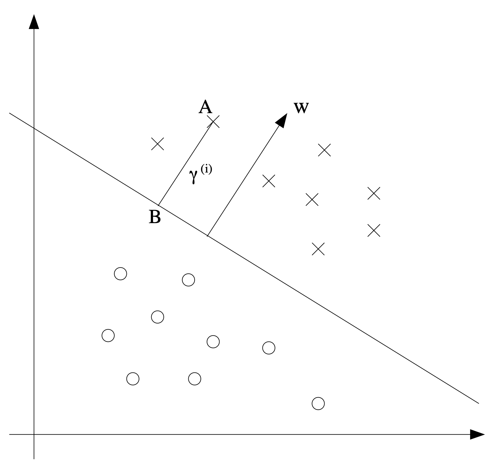
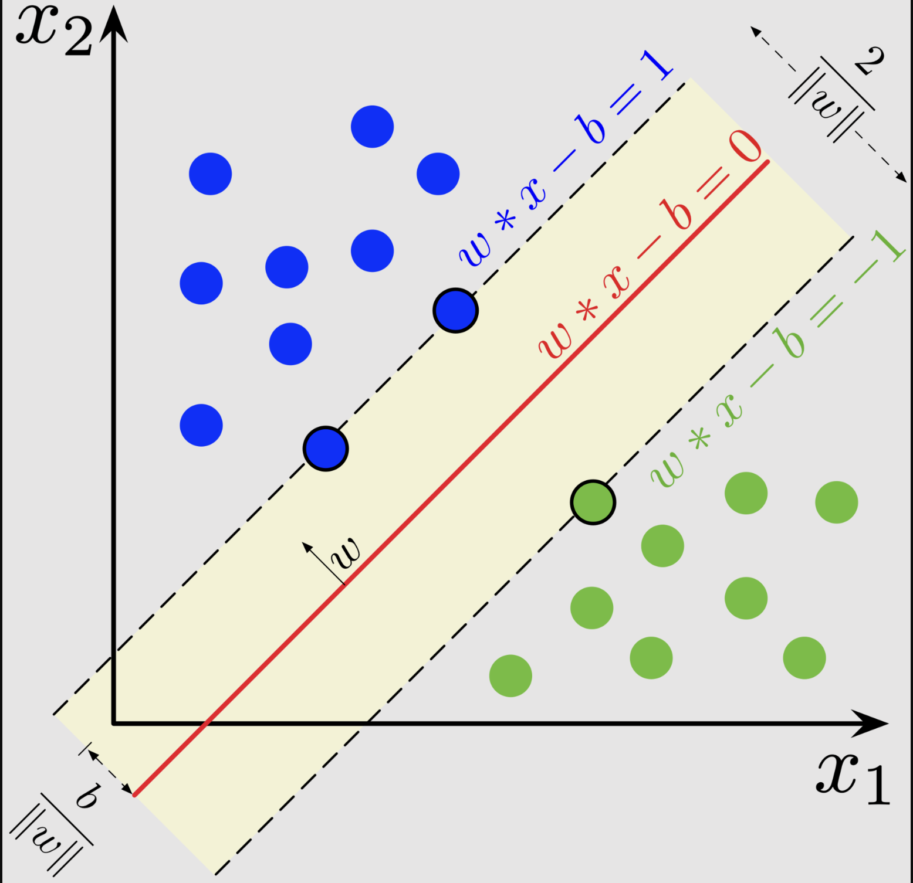

# Suport Vector Machines

TENHO QUE FAZER ISSO DEPOIS COM CALMA, EU ENTENDI AS COISAS, MAS ACHEI MUITO CONFUSO COMO ESCREVER

Máquinas de Vetores Suporte (SVM, do inglês *Support Vector Machines*) é um tipo de algoritmo de aprendizado supervisionado para classificação que foca em tentar achar a fronteira de decisão entre as categorias e traçar um hiperplano que melhor separa esses conjuntos de observações de classes distintas.

INCLUIR AQUI UMA IMAGEM ILUSTRANDO A DIVISÃO ENTRE AS CLASSES

Uma das vantagens do SVM em relação a outros algoritmos de classificação como a regressão logística é como ele consegue se adaptar a fronteiras de decisão não lineares (embora a regressão logística também consiga se adequar a tais fronteiras com as devidas modificações ao conjunto de dados e ao algoritmo).

Para entender tal algoritmo vamos primeiro analisar o caso onde consideramos somente fronteiras de decisão lineares com uma versão primária do SVM, o Classificador de Margem Ótimo (do inglês, Optimal Margin Classifier).

## Classificador de Margem Ótima

Para entender tal classificador temos que primeiro entender o que seriam as "margens" e como elas entram em cena para criarmos um algoritmo de classificação. Existem duas margens que nos interessam aqui: a funcional e a geométrica. A primeira é a confiança que o nosso algoritmo de classificação tem sobre seu predição; a segunda é o quão "justa" é a fronteira de decisão entre as classes. Um ponto importante a ressaltar nessa análise sobre as margens é como estamos tratando somente do caso de uma separação linear entre elas, isto é, uma linha retas as separa devidamente.

O primeiro passo, contudo, é criarmos uma nova notação para este novo modelo. Definimos o novo conjunto de *labels* para a nossa classificação como $y \in \{+1, -1\}$ (em vez de $\{1, 0\}$). Além disso definimos a nossa função que parametriza os valores de $x$ como

$$
h_{w, b}(x) = g(w^Tx+b)
$$

onde $x \in \mathbb{R}^n$ e $b \in \mathbb{R}$, importante notar aqui que não temos mais uma dimensão de $\mathbb{R}^{n+1}$ para $x$, fazíamos isso para incluir o intercepto na equação, mas aqui o colocamos fora como o $b$. Definimos $g$ da seguinte forma

$$
g(z)=
	\begin{cases} 
	  1, & z\geq 0 \\
	  -1, & z<0
	\end{cases}
$$

Importante notar aqui que não estamos então estimando a probabilidade de pertencimento a classe e sim o próprio valor da classe.

### Margens

Para analisar o caso da **margem funcional** vamos dar primeiro um passo para trás e pensar em termos de regressão logística por enquanto. A probabilidade de que uma observação $x$ pertencer a classe $1$ é dada por $h_{\theta}(x)=g(\theta^Tx)$, onde o resultado disso determina o pertencimento a classe se, e somente se, $h_{\theta}(x)>0,5$, e isso só é possível no caso que $\theta^Tx \geq 0$. Ou seja, quanto maior $\theta^Tx$ maior a confiança de que $x$ pertence a classe $1$. Dessa forma podemos dizer informalmente que temos uma grande confiança sobre as nossas previsões se $\theta^Tx \gg 0$ ($\gg$ lê-se "muito maior que"), se $y=1$ e $\theta^Tx \ll 0$ se $y=0$.

Podemos formalizar tal noção da seguinte forma, aqui já usamos a notação descrita acima. A margem funcional do exemplo $(x^{(i)}, y^{(i)})$ parametrizado por $(w, b)$ é dada por

$$
\hat{\gamma}^{(i)} = y^{(i)}(w^T+b).
$$

Note aqui que se $y^{(i)}=1$ então precisamos que o restante da equação seja um número positivo grande ($w^Tx+b >> 0$). No caso contrário, $y^{(i)} = -1$, precisamos que o restante da equação seja um número negativo grande ($w^Tx+b << 0$). Com essa noção podemos então generalizar e dizer que o que buscamos é, para uma dada observação $x^{(i)}$ queremos maximizar $\hat{\gamma}^{(i)}$ e de forma geral, para um conjunto de dados $x$ temos que 

$$
\hat{\gamma} = \min_{i=1,\dots, m} \hat{\gamma}^{(i)}.
$$

Dessa forma temos que, para o conjunto de dados $x$ a margem funcional $\hat{\gamma}$ é o valor mais baixo da confiança sobre cada uma das observações.

Sobre a **margem geométrica** podemos começar considerando o figura abaixo:

*Figura 2: Margem geométrica sobre o exemplo $A$ junto ao vetor $w$ e ponto $B$. Fonte Andrew Ng.

A linha reta é a nossa fronteira de decisão entre os "círculos" e "xs", ela é determinada pelo ponto $b$ e o vetor ortogonal (a 90˚) a ela $w$. O segmento $AB$ nos dá a distância entre o ponto $A$ da reta da fronteira de decisão, vamos denotar essa distância como $\gamma^{(i)}$, agora como podemos achar essa distância?

Sabemos que $\frac{w}{||w||}$ é um vetor unitário que aponta para a mesma direção que $w$, e já que $A$ representa $x^{(i)}$ temos que o ponto $B$ é dado por $x^{(i)} - \gamma^{(i)} \cdot \frac{w}{||w||}$. Só que tal ponto está na reta da fronteira de decisão, e por definição ele satisfaz $w^Tx+b = 0$, logo

$$
w^T \left( x^{(i)} - \gamma^{(i)} \cdot \frac{w}{||w||} \right) + b = 0.
$$

Resolvendo para $\gamma^{(i)}$ temos

$$
\gamma^{(i)} = \frac{w^Tx^{(i)}+b}{||w||} = \left( \frac{w}{||w||} \right)^T x^{(i)} + \frac{b}{||w||}.
$$

Note que esse caso só funciona caso assumamos que $y^{(i)} = 1$, para o caso oposto temos que inverter o sentido do vetor $w$ multiplicando-o por $-1$, que é exatamente o retorno esperado para a função no caso de $y \neq 1$. Outro resultado curioso é que, se $||w||=1$ teremos a margem funcional. Assim temos que a forma geral para a margem geométrica para uma dada observação $(x^{(i)}, y^{(i)})$ é

$$
\gamma^{(i)} = y^{(i)} \left( \left( \frac{w}{||w||} \right)^T x^{(i)} + \frac{b}{||w||} \right)
$$

e, de forma mais geral definimos a margem geométrica para um dado conjunto de dados da mesma forma que definimos a margem funcional:

$$
\gamma = \min_{i=1,\dots, m} \gamma^{(i)}.
$$

> [!note] Diferença entre as notações
> Note que a diferença de notação entre a margem funcional e geométrica é a presença do "chapéu". A margem funcional é denotada por $\hat{\gamma}$, enquanto a margem geométrica é $\gamma$.

### Criando o Classificador de Margem Ótima

Dado essas duas margens estudadas antes, uma continuação natural delas seria montar um classificador que separa duas classes usando como base essas distâncias e margens aqui definidas, contudo, qual deveríamos usar? Inicialmente pode-se pensar que qualquer uma basta, contudo, ao começar a usar a margem funcional, rapidamente se nota que ela tem uma falha considerável.

Dado os nossos dois parâmetros, $w$ e $b$, podemos criar o valor da nossa margem funcional com eles, mas e se os substituíssemos por $2w$ e $2b$? Olhando a fórmula é fácil ver que o valor da nossa estimativa não muda pois o sinal da operação não mudaria, ainda teríamos um valor positivo em $h_{w,b}$, mas o valor da margem seria diferente. Ao aplicar um escalar nos parâmetros modificamos o valor da margem, sendo assim a margem funcional é muito sensível a mudanças na amplitude dos parâmetros a que a torna não tão boa como uma forma de avaliar o desempenho de um classificador. Ao passo que, mesmo que fizéssemos as mesmas alterações na margem geométrica, isso não ocorreria, ela é indiferente a tais modificações. Sendo assim, um bom ponto de partida para um classificador é olharmos para a margem geométrica.

Novamente, supondo que o nosso conjunto de dados pode ser separado por um hiperplano, podemos criar o seguinte problema:

$$
\begin{aligned}
\max_{\gamma,w,b} \quad & \gamma\\
\textrm{s.t.} \quad & {y^{(i)}(w^Tx+b)} \geq \gamma, i=1,\dots,m\\
  &||w||=1    \\
\end{aligned}
$$

Embora a fórmula pareça assustadora ela é relativamente simples de se explicar. Queremos maximizar o valor de $\gamma$, a margem geométrica, dado que qualquer observação do nosso conjunto de dados tem que ter uma margem funcional maior ou igual que o nosso $\gamma$. Em outras palavras escolher a reta que aumenta a distância dos pontos de cada uma da classe em relação a ela. Colocamos a restrição de que $||w||=1$ para que o valor da margem geométrica seja igual ao da funcional garantindo que todas as margens geométricas sejam pelo menos $\gamma$.

Resolvendo esse problema de otimização teríamos já um algoritmo pronto, contudo, ao acrescentar a restrição que garante a margem geométrica, $||w||=1$, também fazemos com que tal problema não seja convexo, o que impede de ele ser resolvido com os métodos que temos. Para isso podemos modificar um tanto o nossa problema no seguinte problema:

$$
\begin{aligned}
\max_{\hat{\gamma},w, b} \quad & \frac{\hat{\gamma}}{||w||}\\
\textrm{s.t.} \quad & {y^{(i)}(w^Tx+b)} \geq \hat{\gamma}, i=1,\dots,m\\
\end{aligned}
$$

Aqui maximizamos $\hat{\gamma}/{||w||}$, o que é equivalente ao que fizemos antes pois $\gamma = \hat{\gamma}/{||w||}$, sujeito as margens funcionais serem pelo menos $\hat{\gamma}$. Contudo, embora tenhamos removido o a restrição que causava o a função ser não convexa, agora a nossa própria função a ser otimizada sofre com esse mal! Então continuamos.

Lembremos que, no caso da margem funcional, podemos adicionar um escalar sem mudar o resultado, é isso que iremos fazer. Adicionemos o seguinte condicional, que $\hat{\gamma}=1$, por que podemos adicionar isso? Lembremos que a margem funcional sofre quando multiplicamos seus valores por uma constante, mas a margem geométrica não. Mesmo que aqui criemos essa restrição sobre a margem funcional, caso mudemos os valores de $w$ e $b$ para a mesma escala o problema permanece o mesmo. Fazendo isso temos que função que queremos maximizar pode ser escrita como ${\hat{\gamma}}/{||w||} = {1}/{||w||}$, além disso isso é o mesmo que minimizar $||w||^2$, logo temos

$$
\begin{aligned}
\min_{w} \quad & \frac{1}{2}||w||^2\\
\textrm{s.t.} \quad & {y^{(i)}(w^Tx+b)} \geq 1, i=1,\dots,m\\
\end{aligned}
$$

Adicionamos o $1/2$ para facilitar o nosso trabalho de manipulação, ele não altera o resultado.

Com isso temos um problema de otimização que pode ser resolvido com uma variedade de métodos para otimização.

> [!NOTE] Como fomos de $1/||w||$ para $||w||^2$?
> Maximizar $1/||w||$ é o mesmo que minimizar $||w||^2$ pois ambas as funções são monotônicas com respeito a $||w||$. Isso é, para colocar em termos leigos, elas uma é o inverso da outra, quando uma cresce a outra diminuí e vice-versa. Assim minimizar uma é o mesmo maximizar a outra.

## Vetores de suporte

O nome "Máquina de Vetores Suporte" (do inglês Support Vector Machine) evidência a existência de um "vetor suporte", o que seriam eles? Para entender isso vamos olhar um exemplo de classificação.

*Figura 3: Hiperplano separando as classes azul e verde. Fonte Wikipedia.*

Nele temos duas classes e conseguimos construir com isso um hiperplano que as separa, linha vermelha, mas como podemos saber que essa é a forma ideal de separarmos? Lembremos que a nossa equação exige que a linha central separe os dois conjuntos dada uma restrição sobre a margem funcional, porém podem existir diversos hiperplanos que separem o conjunto, e embora para a máquina o trabalho esteja feito, muitas vezes para uma aplicação na vida real, algumas fronteiras de decisão são melhores do que outras. Aqui entra os chamados **vetores suporte**, as linhas pontilhadas no exemplo acima.

Como dito anteriormente, podemos escalar os nossos parâmetros $w$ and $b$ e o resultado da margem funcional, $\hat{\gamma}$, também será escalonado. Podemos então dizer que sempre existirá um conjunto de $w$ and $b$ tal que $\hat{\gamma} = 1$. Esse ponto é importante, pois significa que para qualquer conjunto de dados existirá então um conjunto de pontos que está exatamente na margem funcional, onde o valor desta será exatamente $1$ ou $-1$. Na imagem acima esses são os pontos que cruzam a linha pontilhada. Tais pontos são chamados de vetores suporte.

De forma intuitiva podemos então dizer que queremos criar um conjunto de três hiperplanos um central (a linha vermelha da Figura 3) e outros dois nas margens da fronteira de decisão que são paralelos a esse (as linhas pontilhadas).

Na próxima sessão vamos explorar isso com mais detalhes assim como formalizar o problema de classificação.

### Formalização matemática

---

suppose that the parameters w can expressed as a linear combination of the training examples. This can be shown by the representer theorem on why this a reasonable assumption
This "assumption" is true for the optimal value of w
vector w is always orthogonal to the decision boundary

using the assumption we can rewrite the minimization problem as

$$
\begin{aligned}
\min_{\gamma,w,b} \quad & \frac{1}{2}\left( \sum_{i=1}^m \alpha_i y^{(i)} x^{(i)} \right)^T \left( \sum_{j=1}^m \alpha_j y^{(j)} x^{(j)} \right) = \frac{1}{2} \sum_i\sum_j \alpha_i\alpha_j y^{(i)}y^{(j)} x^{(i)^T} x^{(j)}\\
\textrm{s.t.} \quad & {y^{(i)}\left(\left( \sum_{i=1}^m \alpha_i y^{(i)} x^{(i)} \right)^T x^{(i)}+b\right)} \geq 1, i=1,\dots,m\\
\end{aligned}
$$

xˆtx is just the inner product. Is important to write in terms of inner product because the algorithm can be extremely efficient, even with 100trillion dimensions

we can go from this to what is called teh dual optimization problem which commonly used as the "formal" optimization for svm. im lazy to write the whole thing but we are getting rid of the b and maximizing in terms of alpha

## kernels

in steps:

1) write the whole algorithm in terms of inner products
2) let that be some mapping for x -> \phi(x). where \phi makes x to be a higher dimension feature. From x -> [x, xˆ2, xˆ3]
3) find a way to compute k(x, z) = \phi(x)ˆT\phi(z), where k is the kernel function
4) replace <x,z> in algorithm with k(x,z)

**example**
given x \in \mathbb{R}ˆn we can have \phi(x) \in \mathbb{R}ˆnˆ2, meaning that \phi(x) is just all permutations of x multiplied, x = [a, b] \phi(x) = [aa, ab, bb, ba]

need O(nˆ2) time to compute \phi(x)

dont get it what is a kernel trick, need to read it carefully later

svm is optimal margin classifier and kernel trick

(i need to embed the video he used as 48min in here)
https://stats.stackexchange.com/questions/33437/is-it-true-that-in-high-dimensions-data-is-easier-to-separate-linearly
the thing about the kernel trick is that you can take some set of features that arent linearly separable in the 2d plane, and you take then to a higher plane and just so happens that, as you increase dimensions you are more likely to be able to find a hyperplane that can separate the data, so you use this hyperplane to go back to the 2d case.

---
## Referências

Dr. Smirithi Bhandari. SVM - #3 - Optimal Margin Classifier and Dual Formulation. https://www.youtube.com/watch?v=b2OWe2lG9Ng

Stanford Online. Lecture 6 - Support Vector Machines | Stanford CS229: Machine Learning Andrew Ng (Autumn 2018). https://youtu.be/lDwow4aOrtg?si=m-Q5MWrlbrPFywB.

Stanford Online. Lecture 7 - Kernels | Stanford CS229: Machine Learning Andrew Ng (Autumn 2018). https://youtu.be/8NYoQiRANpg?si=i-IjEqJtNv-QPtCp.
